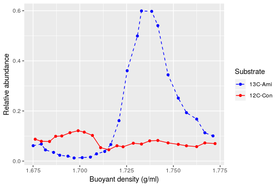

Simple HTSSIP example
================
Samuel Barnett
31 May, 2019

-   [Introduction](#introduction)
-   [Testing treatment-control beta-diversity](#testing-treatment-control-beta-diversity)
-   [MW-HR-SIP](#mw-hr-sip)
-   [Plotting OTU relative abundance over the gradient](#plotting-otu-relative-abundance-over-the-gradient)
-   [More examples](#more-examples)
-   [Session Info](#session-info)

Introduction
------------

This tutorial takes you through a simple example analyzing amplicon based DNA-SIP data with a real dataset using the MW-HR-SIP method. The files used in this tutorial can be found with this github site under the directory [example\_data](example_data/).

The analyses showcased here include:

-   Testing treatment-control beta-diversity
-   Identifying isotope incorporators with MW-HR-SIP
-   Displaying an incorporator's relative abundance distribution across density fractions

For more details on designing and performing DNA-SIP experiments, please refer to the following select sources:

-   Pepe-Ranney C, Campbell AN, Koechli CN, Berthrong S and Buckley DH (2016) Unearthing the Ecology of Soil Microorganisms Using a High Resolution DNA-SIP Approach to Explore Cellulose and Xylose Metabolism in Soil. Front. Microbiol. 7:703. doi: [10.3389/fmicb.2016.00703](https://www.frontiersin.org/articles/10.3389/fmicb.2016.00703/full)
-   Youngblut ND, Barnett SE, Buckley DH (2018) HTSSIP: An R package for analysis of high throughput sequencing data from nucleic acid stable isotope probing (SIP) experiments. PLoS ONE 13(1): e0189616. doi: [10.1371/journal.pone.0189616](https://journals.plos.org/plosone/article?id=10.1371/journal.pone.0189616)
-   Youngblut ND, Barnett SE and Buckley DH (2018) SIPSim: A Modeling Toolkit to Predict Accuracy and Aid Design of DNA-SIP Experiments. Front. Microbiol. 9:570. doi: [10.3389/fmicb.2018.00570](https://www.frontiersin.org/articles/10.3389/fmicb.2018.00570/full)

### R packages needed

As with any R script, the first thing to do is to load the namespace of packages that will be used in the analysis.

``` r
# Packages needed for data handling
library(dplyr)
library(tidyr)
library(tibble)

# Packages needed for analysis
library(phyloseq)   # Used for handling our data format and wraping some functions found in other packages, mainly vegan
library(HTSSIP)     # Contains the main methods used in this analysis

# Packages needed for plotting
library(ggplot2)

# Packages used to make this Rmarkdown notebook look nice
library(knitr)
library(kableExtra)
```

Testing treatment-control beta-diversity
----------------------------------------

Prior to running MW-HR-SIP it is recommended that you check the dissimilarity between the unfractionated treatment and control samples. An unfractionated sample is simply DNA that was extracted from the microcosms and sequenced as-is; no CsCl gradient fractionation. Ideally, as both treatment and control samples were treated the same, with the exception that treatment samples got isotopically labled substrates and controls got unlabled substrates, the communities should be fairly similar. If the treatment and control samples are wildly dissimilar, then it is a sign that there is some systematic difference between the treatment and control and caution should be taken with further analysis. We recommend calculating this beta-diversity using the Bray-Curtis dissimilarity. Ideal dissimilarity between each treatment and its control should less than 0.2.

#### 1. Import data

Unfractionated sample data can be found in the file "unfractionated\_phyloseq.rds". This is an R object containing the data in phyloseq format.

``` r
# Import the data you using the readRDS() function
unfrac.physeq <- readRDS("example_data/unfractionated_phyloseq.rds")

# What does this phyloseq object look like?
unfrac.physeq
```

    ## phyloseq-class experiment-level object
    ## otu_table()   OTU Table:         [ 1533 taxa and 2 samples ]
    ## sample_data() Sample Data:       [ 2 samples by 5 sample variables ]
    ## tax_table()   Taxonomy Table:    [ 1533 taxa by 7 taxonomic ranks ]
    ## phy_tree()    Phylogenetic Tree: [ 1533 tips and 1532 internal nodes ]

#### 2. Rarefy the read counts to an even depth:

Before measuring the beta diversity you need to account for differences in sequencing depth between samples. One common way to do this is by rarefying to an equal depth. There are a number of other ways to do this as well.

``` r
# Before you rarefy, it is good to set the seed so that you can replicate this somewhat stochastic step. Note this was not shown in the chapter.
set.seed(4242)

# Rarefy the data in each of the contrasts.
unfrac.physeq <- rarefy_even_depth(unfrac.physeq)

# Now what does this phyloseq object look like?
unfrac.physeq
```

    ## phyloseq-class experiment-level object
    ## otu_table()   OTU Table:         [ 1298 taxa and 2 samples ]
    ## sample_data() Sample Data:       [ 2 samples by 5 sample variables ]
    ## tax_table()   Taxonomy Table:    [ 1298 taxa by 7 taxonomic ranks ]
    ## phy_tree()    Phylogenetic Tree: [ 1298 tips and 1297 internal nodes ]

#### 3. Calculate Bray-Curtis dissimilarity between samples:

Now you can calculate the Bray-Curtis dissimilarity between your samples.

``` r
# Calculate the Bray-Curtis dissimilarity for each comparison
unfrac.dist <- phyloseq::distance(unfrac.physeq, "bray")

# Print the results
unfrac.dist
```

    ##         13C-Ami
    ## 12C-Con 0.26981

As you can see, the dissimilarity between treatment and control is a bit higher than 0.2. This is ok, as values around this are common and often unavoidable with real world datasets. However, caution may be warranted when interpereting the results.

MW-HR-SIP
---------

Now it is time to run the MW-HR-SIP pipeline to identify isotopically labeled OTUs. This example will just be comparing a single treatment with its control. In most studies, there will be many treatments and corresponding controls. To handle this you can use the function `phyloseq_subset()` to split your starting phyloseq into a list of treatment-control pairs and then run `HRSIP()` on this list. An example of this can be found in [HRSIP\_multiple\_samples.md](HRSIP_multiple_samples.md) as well as the [HTSSIP vignette](https://cran.r-project.org/web/packages/HTSSIP/vignettes/HTSSIP_intro.html).

#### 1. Import data

The data from the gradent fractions can be found in file "SIP\_phyloseq.rds". As before this is an R object containing the data in phyloseq format.

``` r
# Import the data you using the readRDS() function
SIP.physeq <- readRDS("example_data/SIP_phyloseq.rds")

# What does this phyloseq object look like?
SIP.physeq
```

    ## phyloseq-class experiment-level object
    ## otu_table()   OTU Table:         [ 8102 taxa and 47 samples ]
    ## sample_data() Sample Data:       [ 47 samples by 5 sample variables ]
    ## tax_table()   Taxonomy Table:    [ 8102 taxa by 7 taxonomic ranks ]
    ## phy_tree()    Phylogenetic Tree: [ 8102 tips and 8101 internal nodes ]

#### 2. Convert contrasting parameters to factor and order

In this example the contrast (i.e. variable identifying treatment fractions from control fractions), is `substrate`. HRSIP uses DESeq2 to identify labeled OTUs and DESeq2 requires that the contrasting variable be a factor rather than a character vector. Additionally, factors need to be ordered in such a way that identifies which factor is the treatment and which is the control. For more information on this check out the documentation for DESeq2.

In this case you need to convert the variable "substrate" in the sample metadata to a factor and order it as "12C-Con, 13C-Ami", with control first, and treament second.

``` r
# Pull out sample metadata from the phyloseq object
metadata <- data.frame(sample_data(SIP.physeq), stringsAsFactors = F)

# Modify substrate variable as described above
metadata$substrate <- factor(metadata$substrate, level=c("12C-Con", "13C-Ami"))

# Replace sample metadata in phyloseq object with the newly modified metadata
rownames(metadata) <- metadata$Sample_ID
sample_data(SIP.physeq) <- sample_data(metadata)
```

#### 3. Generate list of buoyant density windows, list of sparsity threshold cutoffs, and set the p-value cutoff:

Before running the MW-HR-SIP you need to set some important parameters:

-   **Windows**: The overlaping bouyant density windows you want to analyze. You will be comparing the read counts of OTUs between the treatment and control fractions within these bouyant density windows. `density_min` refers to the minimum BD of each window. `density_max` refers to the maximum BD of each window. Make sure that there are at least 3 fractions each from the treatment and control within each window.
-   **Sparsity**: The sparsity thresholds used to remove OTUs found in very few fractions. Removing these increases your statistical power as it reduces the number of comparisons maked. You want to run this analysis with multiple sparsity threshold cutoffs and choose the one resulting in the most power or the most rejected null hypotheses.
-   **p-value cutoff**: The p-value cutoff below which an OTU is considered significantly enriched in the treatment compared to the control. OTUs with an adjusted p-value below this cutoff will be designated isotopically labeled.

``` r
# Set BD windows
windows <- data.frame(density_min=c(1.70, 1.72, 1.74), 
                     density_max=c(1.73, 1.75, 1.77))

# Set sparsity thresholds
sparsity_list <- c(0, 0.15, 0.30)

# Set pvalue_cutoff
pvalue_cutoff <- 0.05
```

#### 4. Run MW-HR-SIP:

Now you can run the MW-HR-SIP analysis on the data. As you are comparing between "12C-Con" controls and "13C-Ami" treatment samples, the flag `design` will be `~substrate` indicating that the variable `substrate` separates treatment from control. This part may take some time to run. For those with multiple core machines, you can run this step in parallel to speed it up. For more on this see the [HTSSIP vignettes](https://cran.r-project.org/web/packages/HTSSIP/vignettes/MW_HR_SIP.html).

``` r
l2fc.df <- HRSIP(SIP.physeq, 
                density_windows = windows,
                design = ~substrate, 
                padj_cutoff = pvalue_cutoff,
                sparsity_threshold = sparsity_list)
```

    ## Sparsity threshold: 0 
    ## Density window: 1.7-1.73 
    ## Sparsity threshold: 0.15 
    ## Density window: 1.7-1.73 
    ## Sparsity threshold: 0.3 
    ## Density window: 1.7-1.73 
    ## Sparsity threshold: 0 
    ## Density window: 1.72-1.75 
    ## Sparsity threshold: 0.15 
    ## Density window: 1.72-1.75 
    ## Sparsity threshold: 0.3 
    ## Density window: 1.72-1.75 
    ## Sparsity threshold: 0 
    ## Density window: 1.74-1.77 
    ## Sparsity threshold: 0.15 
    ## Density window: 1.74-1.77 
    ## Sparsity threshold: 0.3 
    ## Density window: 1.74-1.77 
    ## Sparsity threshold with the most rejected hypotheses: 0.3

Now you can view the results. Note that this code may look slightly different than in the chapter, mostly to make the output look nice from Rmarkdown. To select just the OTUs that are identified as labeled, filter the dataframe such that `padj <= pvalue_cutoff`.

``` r
# What does the full output dataframe look like? Print out the first 10 entries.
kable(head(l2fc.df, n=10), "html") %>%
  kable_styling() %>%
  scroll_box(width = "100%", height="400px")
```

<table class="table" style="margin-left: auto; margin-right: auto;">
<thead>
<tr>
<th style="text-align:left;">
OTU
</th>
<th style="text-align:right;">
log2FoldChange
</th>
<th style="text-align:right;">
p
</th>
<th style="text-align:right;">
padj
</th>
<th style="text-align:left;">
Domain
</th>
<th style="text-align:left;">
Phylum
</th>
<th style="text-align:left;">
Class
</th>
<th style="text-align:left;">
Order
</th>
<th style="text-align:left;">
Family
</th>
<th style="text-align:left;">
Genus
</th>
<th style="text-align:left;">
Species
</th>
<th style="text-align:right;">
density\_min
</th>
<th style="text-align:right;">
density\_max
</th>
<th style="text-align:right;">
sparsity\_threshold
</th>
<th style="text-align:left;">
sparsity\_apply
</th>
<th style="text-align:right;">
l2fc\_threshold
</th>
</tr>
</thead>
<tbody>
<tr>
<td style="text-align:left;">
OTU.1925
</td>
<td style="text-align:right;">
0.1605744
</td>
<td style="text-align:right;">
0.5640337
</td>
<td style="text-align:right;">
1
</td>
<td style="text-align:left;">
Bacteria
</td>
<td style="text-align:left;">
GAL15
</td>
<td style="text-align:left;">
uncultured bacterium
</td>
<td style="text-align:left;">
uncultured bacterium
</td>
<td style="text-align:left;">
uncultured bacterium
</td>
<td style="text-align:left;">
uncultured bacterium
</td>
<td style="text-align:left;">
uncultured bacterium
</td>
<td style="text-align:right;">
1.7
</td>
<td style="text-align:right;">
1.73
</td>
<td style="text-align:right;">
0.3
</td>
<td style="text-align:left;">
all
</td>
<td style="text-align:right;">
0.25
</td>
</tr>
<tr>
<td style="text-align:left;">
OTU.1059
</td>
<td style="text-align:right;">
0.5038434
</td>
<td style="text-align:right;">
0.4397103
</td>
<td style="text-align:right;">
1
</td>
<td style="text-align:left;">
Bacteria
</td>
<td style="text-align:left;">
Chloroflexi
</td>
<td style="text-align:left;">
TK10
</td>
<td style="text-align:left;">
Ambiguous\_taxa
</td>
<td style="text-align:left;">
Ambiguous\_taxa
</td>
<td style="text-align:left;">
Ambiguous\_taxa
</td>
<td style="text-align:left;">
Ambiguous\_taxa
</td>
<td style="text-align:right;">
1.7
</td>
<td style="text-align:right;">
1.73
</td>
<td style="text-align:right;">
0.3
</td>
<td style="text-align:left;">
all
</td>
<td style="text-align:right;">
0.25
</td>
</tr>
<tr>
<td style="text-align:left;">
OTU.3570
</td>
<td style="text-align:right;">
0.9273268
</td>
<td style="text-align:right;">
0.3301830
</td>
<td style="text-align:right;">
1
</td>
<td style="text-align:left;">
Bacteria
</td>
<td style="text-align:left;">
Chloroflexi
</td>
<td style="text-align:left;">
Anaerolineae
</td>
<td style="text-align:left;">
SBR1031
</td>
<td style="text-align:left;">
A4b
</td>
<td style="text-align:left;">
NA
</td>
<td style="text-align:left;">
NA
</td>
<td style="text-align:right;">
1.7
</td>
<td style="text-align:right;">
1.73
</td>
<td style="text-align:right;">
0.3
</td>
<td style="text-align:left;">
all
</td>
<td style="text-align:right;">
0.25
</td>
</tr>
<tr>
<td style="text-align:left;">
OTU.4370
</td>
<td style="text-align:right;">
0.5345062
</td>
<td style="text-align:right;">
0.4275791
</td>
<td style="text-align:right;">
1
</td>
<td style="text-align:left;">
Bacteria
</td>
<td style="text-align:left;">
Chloroflexi
</td>
<td style="text-align:left;">
Anaerolineae
</td>
<td style="text-align:left;">
SBR1031
</td>
<td style="text-align:left;">
uncultured bacterium
</td>
<td style="text-align:left;">
uncultured bacterium
</td>
<td style="text-align:left;">
uncultured bacterium
</td>
<td style="text-align:right;">
1.7
</td>
<td style="text-align:right;">
1.73
</td>
<td style="text-align:right;">
0.3
</td>
<td style="text-align:left;">
all
</td>
<td style="text-align:right;">
0.25
</td>
</tr>
<tr>
<td style="text-align:left;">
OTU.2750
</td>
<td style="text-align:right;">
0.2551156
</td>
<td style="text-align:right;">
0.4993377
</td>
<td style="text-align:right;">
1
</td>
<td style="text-align:left;">
Bacteria
</td>
<td style="text-align:left;">
Chloroflexi
</td>
<td style="text-align:left;">
Anaerolineae
</td>
<td style="text-align:left;">
SBR1031
</td>
<td style="text-align:left;">
uncultured bacterium
</td>
<td style="text-align:left;">
uncultured bacterium
</td>
<td style="text-align:left;">
uncultured bacterium
</td>
<td style="text-align:right;">
1.7
</td>
<td style="text-align:right;">
1.73
</td>
<td style="text-align:right;">
0.3
</td>
<td style="text-align:left;">
all
</td>
<td style="text-align:right;">
0.25
</td>
</tr>
<tr>
<td style="text-align:left;">
OTU.1833
</td>
<td style="text-align:right;">
0.6757345
</td>
<td style="text-align:right;">
0.3989177
</td>
<td style="text-align:right;">
1
</td>
<td style="text-align:left;">
Bacteria
</td>
<td style="text-align:left;">
Chloroflexi
</td>
<td style="text-align:left;">
Anaerolineae
</td>
<td style="text-align:left;">
SBR1031
</td>
<td style="text-align:left;">
A4b
</td>
<td style="text-align:left;">
Ambiguous\_taxa
</td>
<td style="text-align:left;">
Ambiguous\_taxa
</td>
<td style="text-align:right;">
1.7
</td>
<td style="text-align:right;">
1.73
</td>
<td style="text-align:right;">
0.3
</td>
<td style="text-align:left;">
all
</td>
<td style="text-align:right;">
0.25
</td>
</tr>
<tr>
<td style="text-align:left;">
OTU.1272
</td>
<td style="text-align:right;">
-0.2521604
</td>
<td style="text-align:right;">
0.6960333
</td>
<td style="text-align:right;">
1
</td>
<td style="text-align:left;">
Bacteria
</td>
<td style="text-align:left;">
Chloroflexi
</td>
<td style="text-align:left;">
Anaerolineae
</td>
<td style="text-align:left;">
RBG-13-54-9
</td>
<td style="text-align:left;">
NA
</td>
<td style="text-align:left;">
NA
</td>
<td style="text-align:left;">
NA
</td>
<td style="text-align:right;">
1.7
</td>
<td style="text-align:right;">
1.73
</td>
<td style="text-align:right;">
0.3
</td>
<td style="text-align:left;">
all
</td>
<td style="text-align:right;">
0.25
</td>
</tr>
<tr>
<td style="text-align:left;">
OTU.367
</td>
<td style="text-align:right;">
1.7863947
</td>
<td style="text-align:right;">
0.0831999
</td>
<td style="text-align:right;">
1
</td>
<td style="text-align:left;">
Bacteria
</td>
<td style="text-align:left;">
Chloroflexi
</td>
<td style="text-align:left;">
Anaerolineae
</td>
<td style="text-align:left;">
Anaerolineales
</td>
<td style="text-align:left;">
Anaerolineaceae
</td>
<td style="text-align:left;">
Anaerolinea
</td>
<td style="text-align:left;">
Ambiguous\_taxa
</td>
<td style="text-align:right;">
1.7
</td>
<td style="text-align:right;">
1.73
</td>
<td style="text-align:right;">
0.3
</td>
<td style="text-align:left;">
all
</td>
<td style="text-align:right;">
0.25
</td>
</tr>
<tr>
<td style="text-align:left;">
OTU.2058
</td>
<td style="text-align:right;">
1.6044902
</td>
<td style="text-align:right;">
0.2022700
</td>
<td style="text-align:right;">
1
</td>
<td style="text-align:left;">
Bacteria
</td>
<td style="text-align:left;">
Chloroflexi
</td>
<td style="text-align:left;">
Ktedonobacteria
</td>
<td style="text-align:left;">
Ktedonobacterales
</td>
<td style="text-align:left;">
Ktedonobacteraceae
</td>
<td style="text-align:left;">
FCPS473
</td>
<td style="text-align:left;">
uncultured bacterium
</td>
<td style="text-align:right;">
1.7
</td>
<td style="text-align:right;">
1.73
</td>
<td style="text-align:right;">
0.3
</td>
<td style="text-align:left;">
all
</td>
<td style="text-align:right;">
0.25
</td>
</tr>
<tr>
<td style="text-align:left;">
OTU.2194
</td>
<td style="text-align:right;">
0.1408008
</td>
<td style="text-align:right;">
0.5471573
</td>
<td style="text-align:right;">
1
</td>
<td style="text-align:left;">
Bacteria
</td>
<td style="text-align:left;">
Chloroflexi
</td>
<td style="text-align:left;">
Ktedonobacteria
</td>
<td style="text-align:left;">
Ktedonobacterales
</td>
<td style="text-align:left;">
Ktedonobacteraceae
</td>
<td style="text-align:left;">
HSB OF53-F07
</td>
<td style="text-align:left;">
uncultured bacterium
</td>
<td style="text-align:right;">
1.7
</td>
<td style="text-align:right;">
1.73
</td>
<td style="text-align:right;">
0.3
</td>
<td style="text-align:left;">
all
</td>
<td style="text-align:right;">
0.25
</td>
</tr>
</tbody>
</table>

``` r
# How about the first 10 OTUs identified as labeled?
kable(head(l2fc.df[l2fc.df$padj <= pvalue_cutoff,], n=10), "html") %>%
  kable_styling() %>%
  scroll_box(width = "100%", height="400px")
```

<table class="table" style="margin-left: auto; margin-right: auto;">
<thead>
<tr>
<th style="text-align:left;">
OTU
</th>
<th style="text-align:right;">
log2FoldChange
</th>
<th style="text-align:right;">
p
</th>
<th style="text-align:right;">
padj
</th>
<th style="text-align:left;">
Domain
</th>
<th style="text-align:left;">
Phylum
</th>
<th style="text-align:left;">
Class
</th>
<th style="text-align:left;">
Order
</th>
<th style="text-align:left;">
Family
</th>
<th style="text-align:left;">
Genus
</th>
<th style="text-align:left;">
Species
</th>
<th style="text-align:right;">
density\_min
</th>
<th style="text-align:right;">
density\_max
</th>
<th style="text-align:right;">
sparsity\_threshold
</th>
<th style="text-align:left;">
sparsity\_apply
</th>
<th style="text-align:right;">
l2fc\_threshold
</th>
</tr>
</thead>
<tbody>
<tr>
<td style="text-align:left;">
OTU.18059
</td>
<td style="text-align:right;">
3.468161
</td>
<td style="text-align:right;">
0.0001479
</td>
<td style="text-align:right;">
0.0260126
</td>
<td style="text-align:left;">
Bacteria
</td>
<td style="text-align:left;">
Actinobacteria
</td>
<td style="text-align:left;">
Actinobacteria
</td>
<td style="text-align:left;">
Frankiales
</td>
<td style="text-align:left;">
Acidothermaceae
</td>
<td style="text-align:left;">
Acidothermus
</td>
<td style="text-align:left;">
uncultured bacterium
</td>
<td style="text-align:right;">
1.72
</td>
<td style="text-align:right;">
1.75
</td>
<td style="text-align:right;">
0.3
</td>
<td style="text-align:left;">
all
</td>
<td style="text-align:right;">
0.25
</td>
</tr>
<tr>
<td style="text-align:left;">
OTU.193
</td>
<td style="text-align:right;">
3.759059
</td>
<td style="text-align:right;">
0.0000000
</td>
<td style="text-align:right;">
0.0000014
</td>
<td style="text-align:left;">
Bacteria
</td>
<td style="text-align:left;">
Proteobacteria
</td>
<td style="text-align:left;">
Gammaproteobacteria
</td>
<td style="text-align:left;">
Betaproteobacteriales
</td>
<td style="text-align:left;">
Burkholderiaceae
</td>
<td style="text-align:left;">
Cupriavidus
</td>
<td style="text-align:left;">
Ambiguous\_taxa
</td>
<td style="text-align:right;">
1.72
</td>
<td style="text-align:right;">
1.75
</td>
<td style="text-align:right;">
0.3
</td>
<td style="text-align:left;">
all
</td>
<td style="text-align:right;">
0.25
</td>
</tr>
<tr>
<td style="text-align:left;">
OTU.1
</td>
<td style="text-align:right;">
1.596937
</td>
<td style="text-align:right;">
0.0000127
</td>
<td style="text-align:right;">
0.0029586
</td>
<td style="text-align:left;">
Bacteria
</td>
<td style="text-align:left;">
Proteobacteria
</td>
<td style="text-align:left;">
Gammaproteobacteria
</td>
<td style="text-align:left;">
Betaproteobacteriales
</td>
<td style="text-align:left;">
Burkholderiaceae
</td>
<td style="text-align:left;">
Burkholderia-Caballeronia-Paraburkholderia
</td>
<td style="text-align:left;">
Ambiguous\_taxa
</td>
<td style="text-align:right;">
1.72
</td>
<td style="text-align:right;">
1.75
</td>
<td style="text-align:right;">
0.3
</td>
<td style="text-align:left;">
all
</td>
<td style="text-align:right;">
0.25
</td>
</tr>
<tr>
<td style="text-align:left;">
OTU.66
</td>
<td style="text-align:right;">
2.659613
</td>
<td style="text-align:right;">
0.0000015
</td>
<td style="text-align:right;">
0.0004739
</td>
<td style="text-align:left;">
Bacteria
</td>
<td style="text-align:left;">
Proteobacteria
</td>
<td style="text-align:left;">
Gammaproteobacteria
</td>
<td style="text-align:left;">
Betaproteobacteriales
</td>
<td style="text-align:left;">
Burkholderiaceae
</td>
<td style="text-align:left;">
Burkholderia-Caballeronia-Paraburkholderia
</td>
<td style="text-align:left;">
NA
</td>
<td style="text-align:right;">
1.72
</td>
<td style="text-align:right;">
1.75
</td>
<td style="text-align:right;">
0.3
</td>
<td style="text-align:left;">
all
</td>
<td style="text-align:right;">
0.25
</td>
</tr>
<tr>
<td style="text-align:left;">
OTU.14
</td>
<td style="text-align:right;">
3.577531
</td>
<td style="text-align:right;">
0.0000000
</td>
<td style="text-align:right;">
0.0000000
</td>
<td style="text-align:left;">
Bacteria
</td>
<td style="text-align:left;">
Proteobacteria
</td>
<td style="text-align:left;">
Gammaproteobacteria
</td>
<td style="text-align:left;">
Betaproteobacteriales
</td>
<td style="text-align:left;">
Burkholderiaceae
</td>
<td style="text-align:left;">
Burkholderia-Caballeronia-Paraburkholderia
</td>
<td style="text-align:left;">
Paraburkholderia tropica
</td>
<td style="text-align:right;">
1.72
</td>
<td style="text-align:right;">
1.75
</td>
<td style="text-align:right;">
0.3
</td>
<td style="text-align:left;">
all
</td>
<td style="text-align:right;">
0.25
</td>
</tr>
<tr>
<td style="text-align:left;">
OTU.29540
</td>
<td style="text-align:right;">
5.362351
</td>
<td style="text-align:right;">
0.0000000
</td>
<td style="text-align:right;">
0.0000000
</td>
<td style="text-align:left;">
Bacteria
</td>
<td style="text-align:left;">
Proteobacteria
</td>
<td style="text-align:left;">
Gammaproteobacteria
</td>
<td style="text-align:left;">
Betaproteobacteriales
</td>
<td style="text-align:left;">
Burkholderiaceae
</td>
<td style="text-align:left;">
Burkholderia-Caballeronia-Paraburkholderia
</td>
<td style="text-align:left;">
NA
</td>
<td style="text-align:right;">
1.72
</td>
<td style="text-align:right;">
1.75
</td>
<td style="text-align:right;">
0.3
</td>
<td style="text-align:left;">
all
</td>
<td style="text-align:right;">
0.25
</td>
</tr>
<tr>
<td style="text-align:left;">
OTU.14953
</td>
<td style="text-align:right;">
4.417832
</td>
<td style="text-align:right;">
0.0000000
</td>
<td style="text-align:right;">
0.0000000
</td>
<td style="text-align:left;">
Bacteria
</td>
<td style="text-align:left;">
Proteobacteria
</td>
<td style="text-align:left;">
Gammaproteobacteria
</td>
<td style="text-align:left;">
Betaproteobacteriales
</td>
<td style="text-align:left;">
Burkholderiaceae
</td>
<td style="text-align:left;">
Burkholderia-Caballeronia-Paraburkholderia
</td>
<td style="text-align:left;">
uncultured bacterium
</td>
<td style="text-align:right;">
1.72
</td>
<td style="text-align:right;">
1.75
</td>
<td style="text-align:right;">
0.3
</td>
<td style="text-align:left;">
all
</td>
<td style="text-align:right;">
0.25
</td>
</tr>
<tr>
<td style="text-align:left;">
OTU.23594
</td>
<td style="text-align:right;">
3.612762
</td>
<td style="text-align:right;">
0.0000000
</td>
<td style="text-align:right;">
0.0000000
</td>
<td style="text-align:left;">
Bacteria
</td>
<td style="text-align:left;">
Proteobacteria
</td>
<td style="text-align:left;">
Gammaproteobacteria
</td>
<td style="text-align:left;">
Betaproteobacteriales
</td>
<td style="text-align:left;">
Burkholderiaceae
</td>
<td style="text-align:left;">
Burkholderia-Caballeronia-Paraburkholderia
</td>
<td style="text-align:left;">
Ambiguous\_taxa
</td>
<td style="text-align:right;">
1.72
</td>
<td style="text-align:right;">
1.75
</td>
<td style="text-align:right;">
0.3
</td>
<td style="text-align:left;">
all
</td>
<td style="text-align:right;">
0.25
</td>
</tr>
<tr>
<td style="text-align:left;">
OTU.2
</td>
<td style="text-align:right;">
3.818571
</td>
<td style="text-align:right;">
0.0000000
</td>
<td style="text-align:right;">
0.0000000
</td>
<td style="text-align:left;">
Bacteria
</td>
<td style="text-align:left;">
Proteobacteria
</td>
<td style="text-align:left;">
Gammaproteobacteria
</td>
<td style="text-align:left;">
Betaproteobacteriales
</td>
<td style="text-align:left;">
Burkholderiaceae
</td>
<td style="text-align:left;">
Burkholderia-Caballeronia-Paraburkholderia
</td>
<td style="text-align:left;">
NA
</td>
<td style="text-align:right;">
1.72
</td>
<td style="text-align:right;">
1.75
</td>
<td style="text-align:right;">
0.3
</td>
<td style="text-align:left;">
all
</td>
<td style="text-align:right;">
0.25
</td>
</tr>
<tr>
<td style="text-align:left;">
OTU.27260
</td>
<td style="text-align:right;">
4.202305
</td>
<td style="text-align:right;">
0.0000001
</td>
<td style="text-align:right;">
0.0000559
</td>
<td style="text-align:left;">
Bacteria
</td>
<td style="text-align:left;">
Proteobacteria
</td>
<td style="text-align:left;">
Gammaproteobacteria
</td>
<td style="text-align:left;">
Betaproteobacteriales
</td>
<td style="text-align:left;">
Burkholderiaceae
</td>
<td style="text-align:left;">
Burkholderia-Caballeronia-Paraburkholderia
</td>
<td style="text-align:left;">
NA
</td>
<td style="text-align:right;">
1.72
</td>
<td style="text-align:right;">
1.75
</td>
<td style="text-align:right;">
0.3
</td>
<td style="text-align:left;">
all
</td>
<td style="text-align:right;">
0.25
</td>
</tr>
</tbody>
</table>

``` r
# How many 13C incorporators do we have?
print(paste("There are", length(l2fc.df[l2fc.df$padj < pvalue_cutoff,]$OTU), "labeled OTUs"))
```

    ## [1] "There are 29 labeled OTUs"

#### 5. Save results

Make sure to save your results.

``` r
write.table(l2fc.df, file="example_data/MWHRSIP_output.txt", quote=FALSE, sep="\t", row.names = FALSE, col.names=TRUE)
```

Plotting OTU relative abundance over the gradient
-------------------------------------------------

This is an exmple of one of the common followup analyses you can run. It can be useful to examine the plot of an identified labeled OTU's relative abundance over the entire gradient. This may help to identify labeled OTUs that seem suspect and warrant further examination.

#### 1. Import phyloseq and MW-HR-SIP results

Read count data can again be found in "SIP\_phyloseq.rds". You also need the log2fold change data you just made using `HRSIP()`.

``` r
# Import the phyloseq data you using the readRDS() function
SIP.physeq <- readRDS("example_data/SIP_phyloseq.rds")

# Import the datatable you made before containing list of all OTU's and their results from MW-HR-SIP
l2fc.df <- read.table(file="example_data/MWHRSIP_output.txt", header=TRUE, sep="\t")
```

#### 2. Rarefy read counts and calculate relative abundances

As before you need to adjust read counts across fractions for variation in sequencing depth by rarefying read counts to an equal depth. Again, you can use other methods for this adjustment. For consistency sake, you also could to convert read counts to relative abundance. This means dividing the read count for each OTU by the total read count.

``` r
# Before you rarefy, it is good to set the seed so that you can replicate this somewhat stochastic step. Note this was not shown in the chapter.
set.seed(4242)

# Rarefy the data in each of the contrasts.
SIP.physeq.rare <- rarefy_even_depth(SIP.physeq)

# Transform read counts to relative abundances
SIP.physeq.rare <- transform_sample_counts(SIP.physeq.rare, function(x) x / sum(x))
```

#### 3. Get the OTU table

Next, you need to to extract the OTU table from the phyloseq object. This table contains the relative abundance of each OTU in each sample/fraction. You will also convert this OTU table into a dataframe that is easier to use with ggplot2 for visualization.

``` r
# Extract the OTU table and convert it into an easy to use dataframe
OTU.table <- data.frame(t(otu_table(SIP.physeq.rare))) %>%
  rownames_to_column(var = "Sample_ID") %>%
  gather(key = "OTU", value = "Relative_abundance", -Sample_ID) %>%
  inner_join(data.frame(sample_data(SIP.physeq.rare), stringsAsFactors=FALSE), by = "Sample_ID")
```

#### 4. Plot figure

Now you can plot the relative abundance of any OTU across the gradient fractions. In this case, just look at OTU.2 which was identified as isotopically labeled.

``` r
# Plot figure for OTU.2
ggplot(data=OTU.table[OTU.table$OTU == "OTU.2",], aes(x=Buoyant_density, y=Relative_abundance, color=substrate, linetype=substrate)) +
  geom_point() +
  geom_line() +
  labs(x="Buoyant density (g/ml)", y="Relative abundance", color="Substrate", linetype="Substrate") +
  scale_color_manual(values=c("blue", "red")) +
  scale_linetype_manual(values=c(2, 1))
```



As you can see the distribution of relative abundance of OTU.2 is different between the 13C-Ami treatment and 12C-Con control samples. Note that there is a sharp peak in the treatment no sharp peak in the control gradients. We believe that this may be an artifact of the compositional nature of Illumina based sequencing.

More examples
-------------

The following additional examples go along with this tutorial:

-   [Example with multiple treatments and controls](HRSIP_multiple_samples.md)
-   [Additional prelimiary analyses](addl_prelim_analyses.md)
    -   Beta-diversity across all fractions in treatment and controls
    -   Estimating community BD shift
-   [Additional post MW-HR-SIP analyses](addl_further_analyses.md)
    -   Taxonomy of labeled OTUs
    -   Phylogeny of labeled OTUs

Session Info
------------

``` r
sessionInfo()
```

    ## R version 3.4.4 (2018-03-15)
    ## Platform: x86_64-pc-linux-gnu (64-bit)
    ## Running under: Ubuntu 16.04.4 LTS
    ## 
    ## Matrix products: default
    ## BLAS: /usr/lib/atlas-base/atlas/libblas.so.3.0
    ## LAPACK: /usr/lib/atlas-base/atlas/liblapack.so.3.0
    ## 
    ## locale:
    ##  [1] LC_CTYPE=en_US.UTF-8       LC_NUMERIC=C              
    ##  [3] LC_TIME=en_US.UTF-8        LC_COLLATE=en_US.UTF-8    
    ##  [5] LC_MONETARY=en_US.UTF-8    LC_MESSAGES=en_US.UTF-8   
    ##  [7] LC_PAPER=en_US.UTF-8       LC_NAME=C                 
    ##  [9] LC_ADDRESS=C               LC_TELEPHONE=C            
    ## [11] LC_MEASUREMENT=en_US.UTF-8 LC_IDENTIFICATION=C       
    ## 
    ## attached base packages:
    ## [1] stats     graphics  grDevices utils     datasets  methods   base     
    ## 
    ## other attached packages:
    ## [1] bindrcpp_0.2.2   kableExtra_0.8.0 knitr_1.20       ggplot2_3.1.0   
    ## [5] HTSSIP_1.4.0     phyloseq_1.22.3  tibble_1.4.2     tidyr_0.8.1     
    ## [9] dplyr_0.7.5     
    ## 
    ## loaded via a namespace (and not attached):
    ##   [1] nlme_3.1-137               bitops_1.0-6              
    ##   [3] matrixStats_0.54.0         bit64_0.9-7               
    ##   [5] RColorBrewer_1.1-2         httr_1.3.1                
    ##   [7] rprojroot_1.3-2            GenomeInfoDb_1.14.0       
    ##   [9] tools_3.4.4                backports_1.1.2           
    ##  [11] R6_2.2.2                   vegan_2.5-2               
    ##  [13] rpart_4.1-13               DBI_1.0.0                 
    ##  [15] Hmisc_4.1-1                lazyeval_0.2.1            
    ##  [17] BiocGenerics_0.24.0        mgcv_1.8-24               
    ##  [19] colorspace_1.3-2           permute_0.9-4             
    ##  [21] ade4_1.7-11                nnet_7.3-12               
    ##  [23] withr_2.1.2                tidyselect_0.2.4          
    ##  [25] gridExtra_2.3              DESeq2_1.18.1             
    ##  [27] bit_1.1-14                 compiler_3.4.4            
    ##  [29] rvest_0.3.2                Biobase_2.38.0            
    ##  [31] htmlTable_1.12             xml2_1.2.0                
    ##  [33] DelayedArray_0.4.1         labeling_0.3              
    ##  [35] checkmate_1.8.5            scales_1.0.0              
    ##  [37] genefilter_1.60.0          readr_1.1.1               
    ##  [39] stringr_1.3.1              digest_0.6.16             
    ##  [41] foreign_0.8-71             rmarkdown_1.10            
    ##  [43] XVector_0.18.0             base64enc_0.1-3           
    ##  [45] pkgconfig_2.0.2            htmltools_0.3.6           
    ##  [47] highr_0.7                  htmlwidgets_1.2           
    ##  [49] rlang_0.3.1                RSQLite_2.1.1             
    ##  [51] rstudioapi_0.7             bindr_0.1.1               
    ##  [53] jsonlite_1.5               BiocParallel_1.12.0       
    ##  [55] acepack_1.4.1              RCurl_1.95-4.11           
    ##  [57] magrittr_1.5               GenomeInfoDbData_1.0.0    
    ##  [59] Formula_1.2-3              biomformat_1.6.0          
    ##  [61] Matrix_1.2-14              Rcpp_1.0.1                
    ##  [63] munsell_0.5.0              S4Vectors_0.16.0          
    ##  [65] ape_5.1                    stringi_1.2.4             
    ##  [67] yaml_2.2.0                 MASS_7.3-50               
    ##  [69] SummarizedExperiment_1.8.1 zlibbioc_1.24.0           
    ##  [71] rhdf5_2.22.0               plyr_1.8.4                
    ##  [73] blob_1.1.1                 grid_3.4.4                
    ##  [75] parallel_3.4.4             lattice_0.20-35           
    ##  [77] Biostrings_2.46.0          splines_3.4.4             
    ##  [79] annotate_1.56.2            multtest_2.34.0           
    ##  [81] hms_0.4.2                  locfit_1.5-9.1            
    ##  [83] pillar_1.2.2               igraph_1.2.2              
    ##  [85] GenomicRanges_1.30.3       geneplotter_1.56.0        
    ##  [87] reshape2_1.4.3             codetools_0.2-15          
    ##  [89] stats4_3.4.4               XML_3.98-1.16             
    ##  [91] glue_1.2.0                 evaluate_0.11             
    ##  [93] latticeExtra_0.6-28        data.table_1.11.4         
    ##  [95] foreach_1.4.4              gtable_0.2.0              
    ##  [97] purrr_0.2.5                assertthat_0.2.0          
    ##  [99] xtable_1.8-3               survival_2.42-6           
    ## [101] viridisLite_0.3.0          iterators_1.0.10          
    ## [103] memoise_1.1.0              AnnotationDbi_1.40.0      
    ## [105] IRanges_2.12.0             cluster_2.0.7-1
