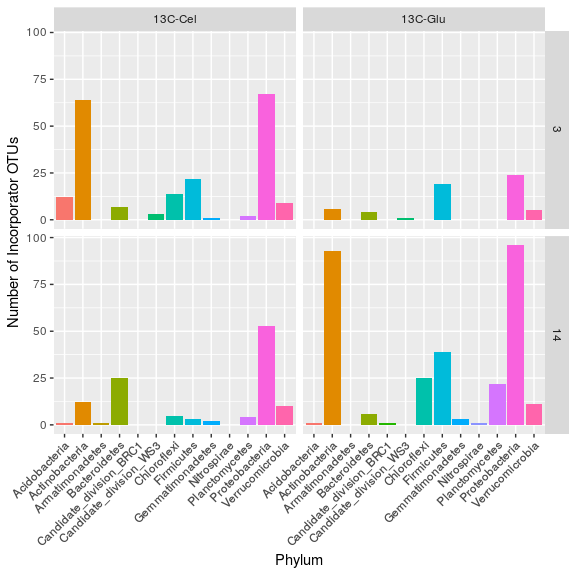
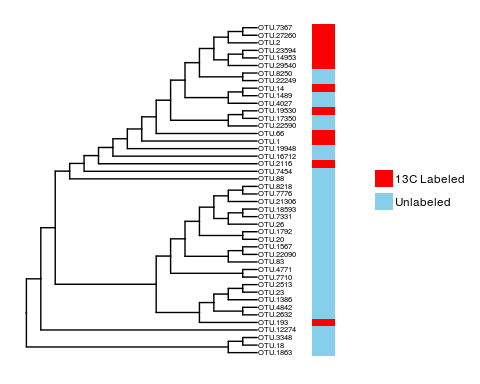
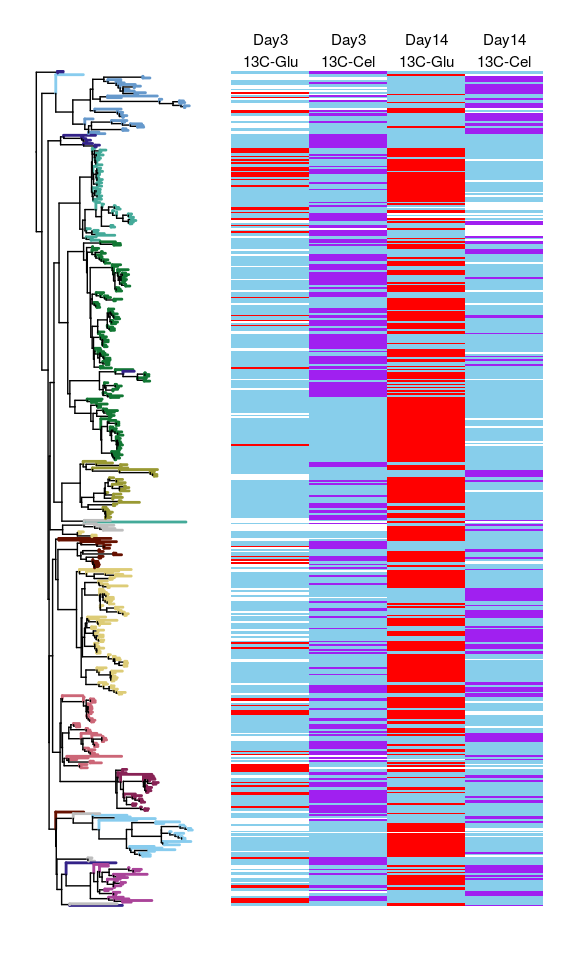
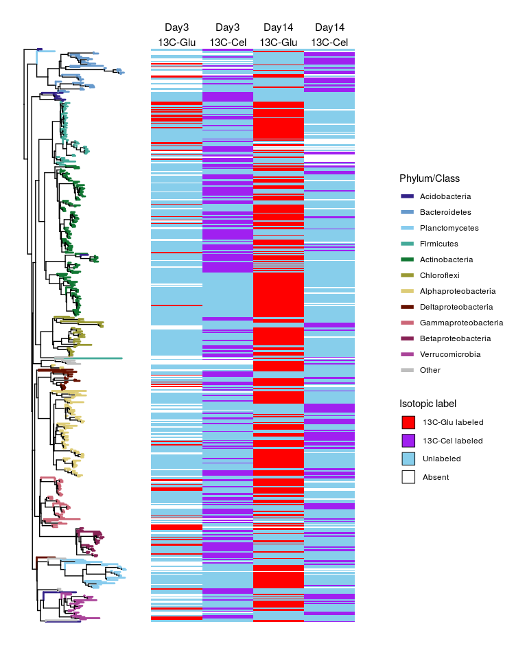

Examples of additional analyses after running MW-HR-SIP
================
Samuel Barnett
May 31, 2019

-   [Introduction](#introduction)
-   [Taxonomy of labeled OTUs](#taxonomy-of-labeled-otus)
-   [Phylogeny of labeled OTUs](#phylogeny-of-labeled-otus)
-   [Session Info](#session-info)

Introduction
------------

There are many analyses that can be performed after running MW-HR-SIP, most of which are study specific. In this tutorial you'll find two basic analyses that may be of common interest. These focus on looking at the type of labeled organisms found through MW-HR-SIP and their phylogenetic relationship. The two analyses are:

-   Examining the taxonomy of labeled OTUs
-   Plotting the phylogeny of labeled OTUs

Data used for these examples come from real DNA-SIP data, also used in the other related tutorials. Before trying these analyses we recommend running through the other tutorials:

-   [Simple MW-HR-SIP example](Chapter_Examples.md)
    -   Beta-diversity between unfractionated treatment and control samples
    -   MW-HR-SIP
    -   Plotting abundance of labeled OTUs across the gradients
-   [Example with multiple treatments and controls](HRSIP_multiple_samples.md)
    -   MW-HR-SIP with two isotope-labeled substrates and two sampling days
-   [Additional prelimiary analyses](addl_prelim_analyses.md)
    -   Beta-diversity across all fractions in treatment and controls
    -   Estimating community BD shift

The files used in this tutorial can be found with this github site under the directory [example\_data](example_data/).

### R packages needed

``` r
# Packages needed for data handling
library(dplyr)
library(tidyr)
library(tibble)
library(phylobase)  # Used for phylogenetic tree formatting

# Packages needed for analysis
library(phyloseq)   # Used for handling our data format

# Packages needed for plotting
library(ggplot2)
library(ggtree)    # Used for plotting phylogenetic trees

# Packages used to make this Rmarkdown notebook look nice
library(knitr)
library(kableExtra)
```

Taxonomy of labeled OTUs
------------------------

Knowing which types of organisms make up your labeled OTUs is an important thing to look. The dataframe produced by the `HRSIP()` command contains the taxonomy of each OTU, if a taxonomy table was already part of the input phyloseq object. If not present, it is easy to tack it on afterwords by matching up OTU IDs between the log2fold change dataframe and your taxonomy table.

Once you have your final data with both log2fold change and taxonomy data, you can view the taxonomy of your labeled OTUs using many methods, such as a simple bar chart. This is a very simple figure but can give you an idea of large compositional differences in labeled OTUs across treatments or give you a basic idea of which taxa are consuming your added substrates. The dataset used for this example will come from the output of the example in [HRSIP\_multiple\_samples](HRSIP_multiple_samples.md). This dataset includes OTUs labeled from either 13C-glucose or 13C-celluloseon, 3 or 14 days after substrate addition.

#### 1. Import data

First import the data from file "MWHRSIP\_S2D2\_output.txt".

``` r
# Import the data as a dataframe
l2fc.df <- read.table("example_data/MWHRSIP_S2D2_output.txt", sep="\t", header=TRUE)

# View out the first 10 results.
kable(head(l2fc.df, n=10), "html") %>%
  kable_styling() %>%
  scroll_box(width = "100%", height="400px")
```

<table class="table" style="margin-left: auto; margin-right: auto;">
<thead>
<tr>
<th style="text-align:left;">
.id
</th>
<th style="text-align:left;">
OTU
</th>
<th style="text-align:right;">
log2FoldChange
</th>
<th style="text-align:right;">
p
</th>
<th style="text-align:right;">
padj
</th>
<th style="text-align:left;">
Rank1
</th>
<th style="text-align:left;">
Rank2
</th>
<th style="text-align:left;">
Rank3
</th>
<th style="text-align:left;">
Rank4
</th>
<th style="text-align:left;">
Rank5
</th>
<th style="text-align:left;">
Rank6
</th>
<th style="text-align:left;">
Rank7
</th>
<th style="text-align:left;">
Rank8
</th>
<th style="text-align:right;">
density\_min
</th>
<th style="text-align:right;">
density\_max
</th>
<th style="text-align:right;">
sparsity\_threshold
</th>
<th style="text-align:left;">
sparsity\_apply
</th>
<th style="text-align:right;">
l2fc\_threshold
</th>
</tr>
</thead>
<tbody>
<tr>
<td style="text-align:left;">
(substrate==12C-Con & day==3) | (substrate==13C-Cel & day == 3)
</td>
<td style="text-align:left;">
OTU.514
</td>
<td style="text-align:right;">
0.6142907
</td>
<td style="text-align:right;">
0.3316127
</td>
<td style="text-align:right;">
0.7656738
</td>
<td style="text-align:left;">
Bacteria
</td>
<td style="text-align:left;">
\_\_Proteobacteria
</td>
<td style="text-align:left;">
\_\_Deltaproteobacteria
</td>
<td style="text-align:left;">
\_\_Desulfobacterales
</td>
<td style="text-align:left;">
\_\_Nitrospinaceae
</td>
<td style="text-align:left;">
\_\_uncultured
</td>
<td style="text-align:left;">
\_\_uncultured\_bacterium
</td>
<td style="text-align:left;">
NA
</td>
<td style="text-align:right;">
1.7
</td>
<td style="text-align:right;">
1.73
</td>
<td style="text-align:right;">
0
</td>
<td style="text-align:left;">
all
</td>
<td style="text-align:right;">
0.25
</td>
</tr>
<tr>
<td style="text-align:left;">
(substrate==12C-Con & day==3) | (substrate==13C-Cel & day == 3)
</td>
<td style="text-align:left;">
OTU.729
</td>
<td style="text-align:right;">
2.1595721
</td>
<td style="text-align:right;">
0.0232760
</td>
<td style="text-align:right;">
0.3587444
</td>
<td style="text-align:left;">
Bacteria
</td>
<td style="text-align:left;">
\_\_Acidobacteria
</td>
<td style="text-align:left;">
\_\_RB25
</td>
<td style="text-align:left;">
\_\_uncultured\_Acidobacteria\_bacterium
</td>
<td style="text-align:left;">
NA
</td>
<td style="text-align:left;">
NA
</td>
<td style="text-align:left;">
NA
</td>
<td style="text-align:left;">
NA
</td>
<td style="text-align:right;">
1.7
</td>
<td style="text-align:right;">
1.73
</td>
<td style="text-align:right;">
0
</td>
<td style="text-align:left;">
all
</td>
<td style="text-align:right;">
0.25
</td>
</tr>
<tr>
<td style="text-align:left;">
(substrate==12C-Con & day==3) | (substrate==13C-Cel & day == 3)
</td>
<td style="text-align:left;">
OTU.2590
</td>
<td style="text-align:right;">
1.1371666
</td>
<td style="text-align:right;">
0.3538736
</td>
<td style="text-align:right;">
0.7656738
</td>
<td style="text-align:left;">
Bacteria
</td>
<td style="text-align:left;">
\_\_Acidobacteria
</td>
<td style="text-align:left;">
\_\_DA023
</td>
<td style="text-align:left;">
\_\_uncultured\_bacterium
</td>
<td style="text-align:left;">
NA
</td>
<td style="text-align:left;">
NA
</td>
<td style="text-align:left;">
NA
</td>
<td style="text-align:left;">
NA
</td>
<td style="text-align:right;">
1.7
</td>
<td style="text-align:right;">
1.73
</td>
<td style="text-align:right;">
0
</td>
<td style="text-align:left;">
all
</td>
<td style="text-align:right;">
0.25
</td>
</tr>
<tr>
<td style="text-align:left;">
(substrate==12C-Con & day==3) | (substrate==13C-Cel & day == 3)
</td>
<td style="text-align:left;">
OTU.3214
</td>
<td style="text-align:right;">
1.3102486
</td>
<td style="text-align:right;">
0.1840562
</td>
<td style="text-align:right;">
0.7656738
</td>
<td style="text-align:left;">
Bacteria
</td>
<td style="text-align:left;">
\_\_Acidobacteria
</td>
<td style="text-align:left;">
\_\_DA023
</td>
<td style="text-align:left;">
\_\_uncultured\_bacterium
</td>
<td style="text-align:left;">
NA
</td>
<td style="text-align:left;">
NA
</td>
<td style="text-align:left;">
NA
</td>
<td style="text-align:left;">
NA
</td>
<td style="text-align:right;">
1.7
</td>
<td style="text-align:right;">
1.73
</td>
<td style="text-align:right;">
0
</td>
<td style="text-align:left;">
all
</td>
<td style="text-align:right;">
0.25
</td>
</tr>
<tr>
<td style="text-align:left;">
(substrate==12C-Con & day==3) | (substrate==13C-Cel & day == 3)
</td>
<td style="text-align:left;">
OTU.1136
</td>
<td style="text-align:right;">
3.1108067
</td>
<td style="text-align:right;">
0.0008800
</td>
<td style="text-align:right;">
0.0442424
</td>
<td style="text-align:left;">
Bacteria
</td>
<td style="text-align:left;">
\_\_Acidobacteria
</td>
<td style="text-align:left;">
\_\_DA023
</td>
<td style="text-align:left;">
\_\_uncultured\_bacterium
</td>
<td style="text-align:left;">
NA
</td>
<td style="text-align:left;">
NA
</td>
<td style="text-align:left;">
NA
</td>
<td style="text-align:left;">
NA
</td>
<td style="text-align:right;">
1.7
</td>
<td style="text-align:right;">
1.73
</td>
<td style="text-align:right;">
0
</td>
<td style="text-align:left;">
all
</td>
<td style="text-align:right;">
0.25
</td>
</tr>
<tr>
<td style="text-align:left;">
(substrate==12C-Con & day==3) | (substrate==13C-Cel & day == 3)
</td>
<td style="text-align:left;">
OTU.11981
</td>
<td style="text-align:right;">
0.0010610
</td>
<td style="text-align:right;">
0.5322244
</td>
<td style="text-align:right;">
0.7656738
</td>
<td style="text-align:left;">
Bacteria
</td>
<td style="text-align:left;">
\_\_Acidobacteria
</td>
<td style="text-align:left;">
\_\_DA023
</td>
<td style="text-align:left;">
NA
</td>
<td style="text-align:left;">
NA
</td>
<td style="text-align:left;">
NA
</td>
<td style="text-align:left;">
NA
</td>
<td style="text-align:left;">
NA
</td>
<td style="text-align:right;">
1.7
</td>
<td style="text-align:right;">
1.73
</td>
<td style="text-align:right;">
0
</td>
<td style="text-align:left;">
all
</td>
<td style="text-align:right;">
0.25
</td>
</tr>
<tr>
<td style="text-align:left;">
(substrate==12C-Con & day==3) | (substrate==13C-Cel & day == 3)
</td>
<td style="text-align:left;">
OTU.3259
</td>
<td style="text-align:right;">
1.2250806
</td>
<td style="text-align:right;">
0.2803700
</td>
<td style="text-align:right;">
0.7656738
</td>
<td style="text-align:left;">
Bacteria
</td>
<td style="text-align:left;">
\_\_Acidobacteria
</td>
<td style="text-align:left;">
\_\_DA023
</td>
<td style="text-align:left;">
\_\_uncultured\_bacterium
</td>
<td style="text-align:left;">
NA
</td>
<td style="text-align:left;">
NA
</td>
<td style="text-align:left;">
NA
</td>
<td style="text-align:left;">
NA
</td>
<td style="text-align:right;">
1.7
</td>
<td style="text-align:right;">
1.73
</td>
<td style="text-align:right;">
0
</td>
<td style="text-align:left;">
all
</td>
<td style="text-align:right;">
0.25
</td>
</tr>
<tr>
<td style="text-align:left;">
(substrate==12C-Con & day==3) | (substrate==13C-Cel & day == 3)
</td>
<td style="text-align:left;">
OTU.13711
</td>
<td style="text-align:right;">
0.0010610
</td>
<td style="text-align:right;">
0.5322244
</td>
<td style="text-align:right;">
0.7656738
</td>
<td style="text-align:left;">
Bacteria
</td>
<td style="text-align:left;">
\_\_Acidobacteria
</td>
<td style="text-align:left;">
\_\_DA023
</td>
<td style="text-align:left;">
\_\_uncultured\_bacterium
</td>
<td style="text-align:left;">
NA
</td>
<td style="text-align:left;">
NA
</td>
<td style="text-align:left;">
NA
</td>
<td style="text-align:left;">
NA
</td>
<td style="text-align:right;">
1.7
</td>
<td style="text-align:right;">
1.73
</td>
<td style="text-align:right;">
0
</td>
<td style="text-align:left;">
all
</td>
<td style="text-align:right;">
0.25
</td>
</tr>
<tr>
<td style="text-align:left;">
(substrate==12C-Con & day==3) | (substrate==13C-Cel & day == 3)
</td>
<td style="text-align:left;">
OTU.2119
</td>
<td style="text-align:right;">
1.5963740
</td>
<td style="text-align:right;">
0.1293840
</td>
<td style="text-align:right;">
0.7656738
</td>
<td style="text-align:left;">
Bacteria
</td>
<td style="text-align:left;">
\_\_Acidobacteria
</td>
<td style="text-align:left;">
\_\_DA023
</td>
<td style="text-align:left;">
NA
</td>
<td style="text-align:left;">
NA
</td>
<td style="text-align:left;">
NA
</td>
<td style="text-align:left;">
NA
</td>
<td style="text-align:left;">
NA
</td>
<td style="text-align:right;">
1.7
</td>
<td style="text-align:right;">
1.73
</td>
<td style="text-align:right;">
0
</td>
<td style="text-align:left;">
all
</td>
<td style="text-align:right;">
0.25
</td>
</tr>
<tr>
<td style="text-align:left;">
(substrate==12C-Con & day==3) | (substrate==13C-Cel & day == 3)
</td>
<td style="text-align:left;">
OTU.6725
</td>
<td style="text-align:right;">
0.0010610
</td>
<td style="text-align:right;">
0.5322244
</td>
<td style="text-align:right;">
0.7656738
</td>
<td style="text-align:left;">
Bacteria
</td>
<td style="text-align:left;">
\_\_Acidobacteria
</td>
<td style="text-align:left;">
\_\_DA023
</td>
<td style="text-align:left;">
NA
</td>
<td style="text-align:left;">
NA
</td>
<td style="text-align:left;">
NA
</td>
<td style="text-align:left;">
NA
</td>
<td style="text-align:left;">
NA
</td>
<td style="text-align:right;">
1.7
</td>
<td style="text-align:right;">
1.73
</td>
<td style="text-align:right;">
0
</td>
<td style="text-align:left;">
all
</td>
<td style="text-align:right;">
0.25
</td>
</tr>
</tbody>
</table>

#### 2. Build a summary table

Now you can build a table of summary statistics that you can more easily view and plot. This table should include the number of labeled OTUs for each phylum from each substrate and day. dplyr and other packages from the [tidyverse](https://www.tidyverse.org/) make working with dataframes easy.

``` r
# Select your pvalue_cutoff that was used in your MW-HR-SIP analysis
pvalue_cutoff <- 0.05

# Get the summary dataframe of just labeled OTU number in each class. There are a number of data management steps used here so read carefully.

# Add columns to your l2fc dataframe indicating substrate and day from that comparison. You can do this by pulling them out of the .id variable
sig.l2fc.df <- l2fc.df %>%
  filter(padj < pvalue_cutoff) %>%                                                # filter to just labeled OTUs
  mutate(day = as.numeric(gsub('.+day==[ \']*([0-9]+).+', '\\1', .id)),
         substrate = as.factor(gsub('.+(13C-[A-z]+).+', '\\1', .id))) %>%         # get a variables day and substrate from the .id variable
  rename(Phylum = Rank2) %>%                                                      # Renaming the Phylum and Class variables for better comprehension
  mutate(Phylum = gsub("__", "", Phylum)) %>%                                     # Removing "__" from the Phylum names to make them nicer looking
  group_by(substrate, day, Phylum) %>%                                            # Grouping by these variables
  summarize(OTU_n = n()) %>%                                                      # Counting the number of OTUs in the groups
  arrange(day, substrate, -OTU_n) %>%                                                             # Ordering dataframe by group OTU counts
  as.data.frame

# View out the results.
kable(sig.l2fc.df, "html") %>%
  kable_styling() %>%
  scroll_box(width = "100%", height="400px")
```

<table class="table" style="margin-left: auto; margin-right: auto;">
<thead>
<tr>
<th style="text-align:left;">
substrate
</th>
<th style="text-align:right;">
day
</th>
<th style="text-align:left;">
Phylum
</th>
<th style="text-align:right;">
OTU\_n
</th>
</tr>
</thead>
<tbody>
<tr>
<td style="text-align:left;">
13C-Cel
</td>
<td style="text-align:right;">
3
</td>
<td style="text-align:left;">
Proteobacteria
</td>
<td style="text-align:right;">
67
</td>
</tr>
<tr>
<td style="text-align:left;">
13C-Cel
</td>
<td style="text-align:right;">
3
</td>
<td style="text-align:left;">
Actinobacteria
</td>
<td style="text-align:right;">
64
</td>
</tr>
<tr>
<td style="text-align:left;">
13C-Cel
</td>
<td style="text-align:right;">
3
</td>
<td style="text-align:left;">
Firmicutes
</td>
<td style="text-align:right;">
22
</td>
</tr>
<tr>
<td style="text-align:left;">
13C-Cel
</td>
<td style="text-align:right;">
3
</td>
<td style="text-align:left;">
Chloroflexi
</td>
<td style="text-align:right;">
14
</td>
</tr>
<tr>
<td style="text-align:left;">
13C-Cel
</td>
<td style="text-align:right;">
3
</td>
<td style="text-align:left;">
Acidobacteria
</td>
<td style="text-align:right;">
12
</td>
</tr>
<tr>
<td style="text-align:left;">
13C-Cel
</td>
<td style="text-align:right;">
3
</td>
<td style="text-align:left;">
Verrucomicrobia
</td>
<td style="text-align:right;">
9
</td>
</tr>
<tr>
<td style="text-align:left;">
13C-Cel
</td>
<td style="text-align:right;">
3
</td>
<td style="text-align:left;">
Bacteroidetes
</td>
<td style="text-align:right;">
7
</td>
</tr>
<tr>
<td style="text-align:left;">
13C-Cel
</td>
<td style="text-align:right;">
3
</td>
<td style="text-align:left;">
Candidate\_division\_WS3
</td>
<td style="text-align:right;">
3
</td>
</tr>
<tr>
<td style="text-align:left;">
13C-Cel
</td>
<td style="text-align:right;">
3
</td>
<td style="text-align:left;">
Planctomycetes
</td>
<td style="text-align:right;">
2
</td>
</tr>
<tr>
<td style="text-align:left;">
13C-Cel
</td>
<td style="text-align:right;">
3
</td>
<td style="text-align:left;">
Gemmatimonadetes
</td>
<td style="text-align:right;">
1
</td>
</tr>
<tr>
<td style="text-align:left;">
13C-Glu
</td>
<td style="text-align:right;">
3
</td>
<td style="text-align:left;">
Proteobacteria
</td>
<td style="text-align:right;">
24
</td>
</tr>
<tr>
<td style="text-align:left;">
13C-Glu
</td>
<td style="text-align:right;">
3
</td>
<td style="text-align:left;">
Firmicutes
</td>
<td style="text-align:right;">
19
</td>
</tr>
<tr>
<td style="text-align:left;">
13C-Glu
</td>
<td style="text-align:right;">
3
</td>
<td style="text-align:left;">
Actinobacteria
</td>
<td style="text-align:right;">
6
</td>
</tr>
<tr>
<td style="text-align:left;">
13C-Glu
</td>
<td style="text-align:right;">
3
</td>
<td style="text-align:left;">
Verrucomicrobia
</td>
<td style="text-align:right;">
5
</td>
</tr>
<tr>
<td style="text-align:left;">
13C-Glu
</td>
<td style="text-align:right;">
3
</td>
<td style="text-align:left;">
Bacteroidetes
</td>
<td style="text-align:right;">
4
</td>
</tr>
<tr>
<td style="text-align:left;">
13C-Glu
</td>
<td style="text-align:right;">
3
</td>
<td style="text-align:left;">
Candidate\_division\_WS3
</td>
<td style="text-align:right;">
1
</td>
</tr>
<tr>
<td style="text-align:left;">
13C-Cel
</td>
<td style="text-align:right;">
14
</td>
<td style="text-align:left;">
Proteobacteria
</td>
<td style="text-align:right;">
53
</td>
</tr>
<tr>
<td style="text-align:left;">
13C-Cel
</td>
<td style="text-align:right;">
14
</td>
<td style="text-align:left;">
Bacteroidetes
</td>
<td style="text-align:right;">
25
</td>
</tr>
<tr>
<td style="text-align:left;">
13C-Cel
</td>
<td style="text-align:right;">
14
</td>
<td style="text-align:left;">
Actinobacteria
</td>
<td style="text-align:right;">
12
</td>
</tr>
<tr>
<td style="text-align:left;">
13C-Cel
</td>
<td style="text-align:right;">
14
</td>
<td style="text-align:left;">
Verrucomicrobia
</td>
<td style="text-align:right;">
10
</td>
</tr>
<tr>
<td style="text-align:left;">
13C-Cel
</td>
<td style="text-align:right;">
14
</td>
<td style="text-align:left;">
Chloroflexi
</td>
<td style="text-align:right;">
5
</td>
</tr>
<tr>
<td style="text-align:left;">
13C-Cel
</td>
<td style="text-align:right;">
14
</td>
<td style="text-align:left;">
Planctomycetes
</td>
<td style="text-align:right;">
4
</td>
</tr>
<tr>
<td style="text-align:left;">
13C-Cel
</td>
<td style="text-align:right;">
14
</td>
<td style="text-align:left;">
Firmicutes
</td>
<td style="text-align:right;">
3
</td>
</tr>
<tr>
<td style="text-align:left;">
13C-Cel
</td>
<td style="text-align:right;">
14
</td>
<td style="text-align:left;">
Gemmatimonadetes
</td>
<td style="text-align:right;">
2
</td>
</tr>
<tr>
<td style="text-align:left;">
13C-Cel
</td>
<td style="text-align:right;">
14
</td>
<td style="text-align:left;">
Acidobacteria
</td>
<td style="text-align:right;">
1
</td>
</tr>
<tr>
<td style="text-align:left;">
13C-Cel
</td>
<td style="text-align:right;">
14
</td>
<td style="text-align:left;">
Armatimonadetes
</td>
<td style="text-align:right;">
1
</td>
</tr>
<tr>
<td style="text-align:left;">
13C-Glu
</td>
<td style="text-align:right;">
14
</td>
<td style="text-align:left;">
Proteobacteria
</td>
<td style="text-align:right;">
96
</td>
</tr>
<tr>
<td style="text-align:left;">
13C-Glu
</td>
<td style="text-align:right;">
14
</td>
<td style="text-align:left;">
Actinobacteria
</td>
<td style="text-align:right;">
93
</td>
</tr>
<tr>
<td style="text-align:left;">
13C-Glu
</td>
<td style="text-align:right;">
14
</td>
<td style="text-align:left;">
Firmicutes
</td>
<td style="text-align:right;">
39
</td>
</tr>
<tr>
<td style="text-align:left;">
13C-Glu
</td>
<td style="text-align:right;">
14
</td>
<td style="text-align:left;">
Chloroflexi
</td>
<td style="text-align:right;">
25
</td>
</tr>
<tr>
<td style="text-align:left;">
13C-Glu
</td>
<td style="text-align:right;">
14
</td>
<td style="text-align:left;">
Planctomycetes
</td>
<td style="text-align:right;">
22
</td>
</tr>
<tr>
<td style="text-align:left;">
13C-Glu
</td>
<td style="text-align:right;">
14
</td>
<td style="text-align:left;">
Verrucomicrobia
</td>
<td style="text-align:right;">
11
</td>
</tr>
<tr>
<td style="text-align:left;">
13C-Glu
</td>
<td style="text-align:right;">
14
</td>
<td style="text-align:left;">
Bacteroidetes
</td>
<td style="text-align:right;">
6
</td>
</tr>
<tr>
<td style="text-align:left;">
13C-Glu
</td>
<td style="text-align:right;">
14
</td>
<td style="text-align:left;">
Gemmatimonadetes
</td>
<td style="text-align:right;">
3
</td>
</tr>
<tr>
<td style="text-align:left;">
13C-Glu
</td>
<td style="text-align:right;">
14
</td>
<td style="text-align:left;">
Acidobacteria
</td>
<td style="text-align:right;">
1
</td>
</tr>
<tr>
<td style="text-align:left;">
13C-Glu
</td>
<td style="text-align:right;">
14
</td>
<td style="text-align:left;">
Candidate\_division\_BRC1
</td>
<td style="text-align:right;">
1
</td>
</tr>
<tr>
<td style="text-align:left;">
13C-Glu
</td>
<td style="text-align:right;">
14
</td>
<td style="text-align:left;">
Nitrospirae
</td>
<td style="text-align:right;">
1
</td>
</tr>
</tbody>
</table>

#### 3. Plot bar chart

Now you can plot the data from the summary table. To compare the taxonomy of labeled OTUs between substrates and days you can plot the data faceting by these variables.

``` r
ggplot(data=sig.l2fc.df, aes(x=Phylum, y=OTU_n, fill=Phylum)) +
  geom_bar(stat="identity") +
  facet_grid(day~substrate) + 
  labs(x = "Phylum", y = "Number of Incorporator OTUs", fill = "Phylum") +
  theme(axis.text.x = element_text(angle=45, hjust=1),
        legend.position = "none")
```



Phylogeny of labeled OTUs
-------------------------

Similar to analysis with taxonomy, it can be interesting to see how closely related some labeled OTUs are and which samples they are labled in. One way to visualize this is to make a heatmap of isotope labeling which OTUs ordered by their positions in a phylogenetic tree. From these figures you can potentially see clustering of functions within phylogenetic clades.

These figures can get pretty large and complicated so in many cases it is best to split up figures into descrete groups, such as by Phylum. The following are two examples for making these figures. The first will be a simple case using data from one single substrate and sampling timepoint. The second example is more complicated and includes two substrates and two days.

### Simple example

This example will use the MW-HR-SIP results from [Chapter\_Examples](Chapter_Examples.md) and phyloseq used in that tutorial. This dataset included only one substrate and sampling timepoint. The resulting figure will show the labeling of OTUs from just the family Burkholderiaceae.

#### 1. Import data

First, import both the log2fold change dataframe generated by the MW-HR-SIP analysis and the phyloseq object containing the original data. These files are called "MWHRSIP\_output.txt" and "example\_phyloseq.rds" respectively.

``` r
# Import the MW-HR-SIP output
l2fc.df <- read.table(file="example_data/MWHRSIP_output.txt", sep="\t", header=TRUE)

# Import the phyloseq object
physeq <- readRDS("example_data/SIP_phyloseq.rds")
physeq
```

    ## phyloseq-class experiment-level object
    ## otu_table()   OTU Table:         [ 8102 taxa and 47 samples ]
    ## sample_data() Sample Data:       [ 47 samples by 5 sample variables ]
    ## tax_table()   Taxonomy Table:    [ 8102 taxa by 7 taxonomic ranks ]
    ## phy_tree()    Phylogenetic Tree: [ 8102 tips and 8101 internal nodes ]

#### 2. Filter data

Now you'll want to filter the data to just include OTUs in the family Burkholderiaceae as well as indicate which OTUs are identified as labeled or unlabeled.

``` r
# Select your pvalue_cutoff that was used in your MW-HR-SIP analysis
pvalue_cutoff <- 0.05

# Filter log2fold change dataframe and include just labeling status for each OTU
Burk.l2fc.df <- l2fc.df %>%
  filter(Family == "Burkholderiaceae") %>%
  mutate(Labeled = ifelse(padj <= pvalue_cutoff, "13C Labeled", "Unlabeled")) %>%
  select(OTU, Labeled)

# Set rownames to be the OTU ID then remove the OTU column. This is necessary for the plotting function
rownames(Burk.l2fc.df) <- Burk.l2fc.df$OTU
Burk.l2fc.df$OTU <- NULL

# Filter the phyloseq object to include just Burkholderiaceae OTUs
Burk.physeq <- prune_taxa(rownames(Burk.l2fc.df), physeq)
```

#### 3. Get phylogenetic tree

The phylogenetic tree is part of the phyloseq object. For this method you need to extract the tree in `phylo` format and then convert it into `phylo4` format.

``` r
# Extract phylogenetic tree from phyloseq object
tree <- phy_tree(Burk.physeq)

# Convert the tree to phylo4 format
tree <- as(tree, 'phylo4')
```

#### 4. Plot figure

Now you can plot the figure using functions from package ggtree. There are other methods for plotting but this packaged makes the code fairly simple.

``` r
# Plot the phylogenetic tree
tree.plot <- ggtree(tree, branch.length="none") + geom_tiplab(size=2)

# Set colors for labeling status
labeling.colors <- c("red", "skyblue")
names(labeling.colors) <- c("13C Labeled", "Unlabeled")

# Add heatmap to the tree plot
tree.heat.plot <- gheatmap(tree.plot, Burk.l2fc.df, color=NULL, offset=3, width=.1, colnames=FALSE) +
  scale_fill_manual(values = labeling.colors) +
  guides(fill = guide_legend(override.aes = list(size=2)))

tree.heat.plot
```



You can easily save this figure in multiple file formats (e.g. jpeg, tiff, pdf, svg) using the command `ggsave()`.

### More complex example

In most real world studies you will have multiple substrates, sample types, or timepoints. Cases with multiple treatments are where this type of figure may be even more interesting, but also more complicated to make. The following is an example using data including samples from two 13C-substrates and two timepoints. The dataset for this example will come from the output of [HRSIP\_multiple\_samples](HRSIP_multiple_samples.md) as well as the phyloseq object used in that tutorial

#### 1. Import data

Import both the log2fold change dataframe from the MW-HR-SIP analysis and the phyloseq containing the original data. These files are called "MWHRSIP\_S2D2\_output.txt" and "example\_S2D2\_phyloseq.rds" respectively.

``` r
# Import the MW-HR-SIP output
l2fc.df <- read.table(file="example_data/MWHRSIP_S2D2_output.txt", sep="\t", header=TRUE)

# Import the phyloseq object
physeq <- readRDS("example_data/example_S2D2_phyloseq.rds")
physeq
```

    ## phyloseq-class experiment-level object
    ## otu_table()   OTU Table:         [ 10001 taxa and 139 samples ]
    ## sample_data() Sample Data:       [ 139 samples by 5 sample variables ]
    ## tax_table()   Taxonomy Table:    [ 10001 taxa by 8 taxonomic ranks ]
    ## phy_tree()    Phylogenetic Tree: [ 10001 tips and 10000 internal nodes ]

#### 2. Filter data

Filter the dataset to just include OTUs that are labeled in at least one sample (i.e. remove unlabled OTUs).

``` r
# Select your pvalue_cutoff that was used in your MW-HR-SIP analysis
pvalue_cutoff <- 0.05

# Find OTUs that are labeled in at least one sample
lab.OTUs <- unique(l2fc.df[l2fc.df$padj <= pvalue_cutoff,]$OTU)

# Filter log2fold change dataframe and include just labeling status for each OTU
lab.l2fc.df <- l2fc.df %>%
  filter(OTU %in% lab.OTUs) %>%
  mutate(day = as.numeric(gsub('.+day==[ \']*([0-9]+).+', '\\1', .id)),
         substrate = as.factor(gsub('.+(13C-[A-z]+).+', '\\1', .id))) %>%
  mutate(treatment = paste("Day", day, "\n", substrate, sep=""),
         Labeled = ifelse(padj <= pvalue_cutoff, paste(substrate, "labeled"), 
                          "Unlabeled")) %>%
  select(OTU, Labeled, treatment) %>%
  spread(key=treatment, value=Labeled) %>%
  select(OTU, "Day3\n13C-Glu", "Day3\n13C-Cel", 
         "Day14\n13C-Glu", "Day14\n13C-Cel")
  

# Set rownames to be the OTU ID then remove the OTU column. This is necessary for the plotting function
rownames(lab.l2fc.df) <- lab.l2fc.df$OTU
lab.l2fc.df$OTU <- NULL

# All NA values indicate that an OTU is absent from the dataset in that particular sample
lab.l2fc.df[is.na(lab.l2fc.df)] <- "Absent"

# Filter the phyloseq object to include just Burkholderiaceae OTUs
lab.physeq <- prune_taxa(rownames(lab.l2fc.df), physeq)
```

#### 3. Get phylogenetic tree

The phylogenetic tree is part of the phyloseq object. For this method you need to extract the tree in `phylo` format and then convert it into `phylo4` format.

``` r
# Extract phylogenetic tree from phyloseq object
tree <- phy_tree(lab.physeq)

# Convert the tree to phylo4 format
tree <- as(tree, 'phylo4d')
```

#### 4. Get colors for phyla

In this example you are going to color the tips of the tree based on the OTU phylum. To do this you need to first set these colors. Since Proteobacteria includes multiple important groups, you will color tips from this phylum by their class (i.e. Alphaproteobacteria, Betaproteobacteria, Gammaproteobacteria, and Deltaproteobacteria). To reduce figure complexity, only assign a color to phyla that that have more than 10 labeled OTUs, setting all other phyla to "Other". This helps to reduce the number of colors you use, especially if you are being colorblind friendly.

``` r
# Get taxonomy table of these labeled OTUs. This is part of the phyloseq object. 
tax.table <- data.frame(tax_table(lab.physeq), stringsAsFactors = F) %>%
  rownames_to_column(var="OTU") %>%
  mutate(Rank2 = gsub("__", "", Rank2),
         Rank3 = gsub("__", "", Rank3)) %>%
  mutate(Taxa = ifelse(Rank2 == "Proteobacteria", Rank3, Rank2)) %>%
  select(OTU, Taxa) %>%
  group_by(Taxa) %>%
  mutate(OTU_n = n()) %>%
  ungroup() %>%
  mutate(Taxa = ifelse(OTU_n >= 10, Taxa, "Other"))

# Set colors for the phylm. A good set of colors to use is Paul Tol colors (https://tradeblotter.wordpress.com/2013/02/28/the-paul-tol-21-color-salute/). OTUs with Taxa = "Other" should be grey
tol11qualitative=c("#332288", "#6699CC", "#88CCEE", "#44AA99", 
                   "#117733", "#999933", "#DDCC77", "#661100", 
                   "#CC6677", "#882255", "#AA4499")

Taxa.list <- unique(tax.table[tax.table$Taxa != "Other",]$Taxa)

Taxa_colors <- data.frame(color = c(tol11qualitative, "grey"),
                          Taxa = c(Taxa.list, "Other"), stringsAsFactors = F)

tax.table <- full_join(tax.table, Taxa_colors, by="Taxa") %>%
  mutate(size=1) %>%
  select(OTU, Taxa, color, size)
rownames(tax.table) <- tax.table$OTU
tax.table$OTU <- NULL

# Add colors and phylum names to the tree file
tree2 <- addData(tree, tip.data=tax.table)

# Set internal node colors to black
rNodeData <- data.frame(color = rep("black", nNodes(tree2)), size=.5, row.names = nodeId(tree2, "internal"))
nodeData(tree2) <- rNodeData
```

#### 5. Plot figure

Now you can plot the figure using functions from package ggtree.

``` r
# Plot the phylogenetic tree
tree.plot <- ggtree(tree2, aes(color=I(color), size=I(size)))

# This is a quick fix to make gheatmap() work with phylo4d data. Convert the variable "label", which includes the tip labeles, from a factor to a character vector.
tree.plot.data <- tree.plot$data %>%
  mutate(label = as.character(label))
tree.plot$data <- tree.plot.data

# Set colors for labeling status
labeling.colors <- c("red", "purple",
                    "skyblue", "white")
names(labeling.colors) <- c("13C-Glu labeled", "13C-Cel labeled", 
                           "Unlabeled", "Absent")

# Add heatmap to the tree plot
tree.heat.plot <- gheatmap(tree.plot, lab.l2fc.df, color=NULL, 
                          offset=0, width=2, colnames=TRUE, 
                          colnames_position="top", colnames_offset_y=12) +
  scale_fill_manual(values = labeling.colors) +
  guides(fill = guide_legend(override.aes = list(size=2))) + 
  theme(legend.position = "none")

tree.heat.plot
```



#### 6. Make a better legend including Phyla colors

The previous figure doesn't include a legend with phylum colors but you want it so that readers can understand the phylogenetic tree. Since you are adding another legend anyways, you can make the heatmap one a bit better while you're at it. You hid it in the heatmap legend in the previous figure using `theme(legend.position = "none")`.

To get a legend for the phyla colors, you can simply make another figure and use the legend from that one. There are probably many other ways to do this.

``` r
# Generate a function for pulling a legend out of a plot (code from https://stackoverflow.com/questions/11883844/inserting-a-table-under-the-legend-in-a-ggplot2-histogram)
g_legend<-function(a.gplot){
  tmp <- ggplot_gtable(ggplot_build(a.gplot))
  leg <- which(sapply(tmp$grobs, function(x) x$name) == "guide-box")
  legend <- tmp$grobs[[leg]]
  return(legend)}

# Before making the legend you need two dataframes containing the legend info. This is a chance to put the legend elements in a specific order, such as having phylum "other" or isotopic label "absent" at the end of their lists.
temp.tax.df <- unique(tax.table)
temp.tax.df$Taxa <- factor(temp.tax.df$Taxa, 
                          levels=c(setdiff(temp.tax.df$Taxa, "Other"), "Other"))

temp.lab.df <- gather(lab.l2fc.df, value=label, key=treatment) %>%
  select(label) %>%
  unique
temp.lab.df$label <- factor(temp.lab.df$label, 
                           levels=c("13C-Glu labeled","13C-Cel labeled", "Unlabeled", "Absent"))

# Make a temporary plot to get a better legend
phyla.colors <- temp.tax.df$color
names(phyla.colors) <- temp.tax.df$Taxa

temp.plot <- ggplot(data=temp.tax.df) +
  geom_hline(aes(yintercept=0, color=Taxa), size=2) +
  geom_point(data=temp.lab.df, aes(fill=label), x=1, y=1, shape=22, size=7) + 
  lims(x=c(0,1), y=c(-1,1)) +
  scale_color_manual(values = phyla.colors) +
  scale_fill_manual(values = labeling.colors) +
  labs(color="Phylum/Class", fill="Isotopic label") +
  theme_bw()

legend.grob <- g_legend(temp.plot)

# Make plot with added legend
fin.tree.heat.plot <- cowplot::plot_grid(tree.heat.plot, legend.grob, ncol=2, rel_widths=c(1,.4))

fin.tree.heat.plot
```



Session Info
------------

``` r
sessionInfo()
```

    ## R version 3.4.4 (2018-03-15)
    ## Platform: x86_64-pc-linux-gnu (64-bit)
    ## Running under: Ubuntu 16.04.4 LTS
    ## 
    ## Matrix products: default
    ## BLAS: /usr/lib/atlas-base/atlas/libblas.so.3.0
    ## LAPACK: /usr/lib/atlas-base/atlas/liblapack.so.3.0
    ## 
    ## locale:
    ##  [1] LC_CTYPE=en_US.UTF-8       LC_NUMERIC=C              
    ##  [3] LC_TIME=en_US.UTF-8        LC_COLLATE=en_US.UTF-8    
    ##  [5] LC_MONETARY=en_US.UTF-8    LC_MESSAGES=en_US.UTF-8   
    ##  [7] LC_PAPER=en_US.UTF-8       LC_NAME=C                 
    ##  [9] LC_ADDRESS=C               LC_TELEPHONE=C            
    ## [11] LC_MEASUREMENT=en_US.UTF-8 LC_IDENTIFICATION=C       
    ## 
    ## attached base packages:
    ## [1] stats     graphics  grDevices utils     datasets  methods   base     
    ## 
    ## other attached packages:
    ##  [1] bindrcpp_0.2.2   kableExtra_0.8.0 knitr_1.20       ggtree_1.8.2    
    ##  [5] treeio_1.0.2     ggplot2_3.1.0    phyloseq_1.22.3  phylobase_0.8.4 
    ##  [9] tibble_1.4.2     tidyr_0.8.1      dplyr_0.7.5     
    ## 
    ## loaded via a namespace (and not attached):
    ##  [1] Biobase_2.38.0      httr_1.3.1          viridisLite_0.3.0  
    ##  [4] jsonlite_1.5        splines_3.4.4       foreach_1.4.4      
    ##  [7] assertthat_0.2.0    highr_0.7           rvcheck_0.1.0      
    ## [10] stats4_3.4.4        yaml_2.2.0          progress_1.1.2     
    ## [13] pillar_1.2.2        backports_1.1.2     lattice_0.20-35    
    ## [16] glue_1.2.0          uuid_0.1-2          digest_0.6.16      
    ## [19] XVector_0.18.0      rvest_0.3.2         colorspace_1.3-2   
    ## [22] cowplot_0.9.2       htmltools_0.3.6     Matrix_1.2-14      
    ## [25] plyr_1.8.4          XML_3.98-1.16       pkgconfig_2.0.2    
    ## [28] rncl_0.8.2          zlibbioc_1.24.0     purrr_0.2.5        
    ## [31] scales_1.0.0        mgcv_1.8-24         IRanges_2.12.0     
    ## [34] withr_2.1.2         BiocGenerics_0.24.0 lazyeval_0.2.1     
    ## [37] survival_2.42-6     magrittr_1.5        evaluate_0.11      
    ## [40] nlme_3.1-137        MASS_7.3-50         xml2_1.2.0         
    ## [43] vegan_2.5-2         tools_3.4.4         data.table_1.11.4  
    ## [46] prettyunits_1.0.2   hms_0.4.2           stringr_1.3.1      
    ## [49] S4Vectors_0.16.0    munsell_0.5.0       cluster_2.0.7-1    
    ## [52] Biostrings_2.46.0   ade4_1.7-11         compiler_3.4.4     
    ## [55] RNeXML_2.1.1        rlang_0.3.1         rhdf5_2.22.0       
    ## [58] grid_3.4.4          rstudioapi_0.7      iterators_1.0.10   
    ## [61] biomformat_1.6.0    igraph_1.2.2        labeling_0.3       
    ## [64] rmarkdown_1.10      gtable_0.2.0        codetools_0.2-15   
    ## [67] multtest_2.34.0     reshape2_1.4.3      R6_2.2.2           
    ## [70] bindr_0.1.1         rprojroot_1.3-2     permute_0.9-4      
    ## [73] readr_1.1.1         ape_5.1             stringi_1.2.4      
    ## [76] parallel_3.4.4      Rcpp_1.0.1          tidyselect_0.2.4
