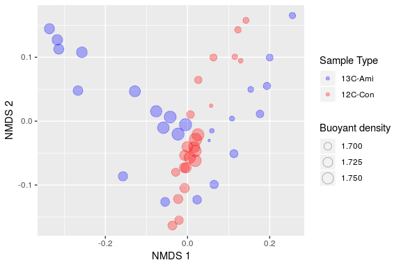
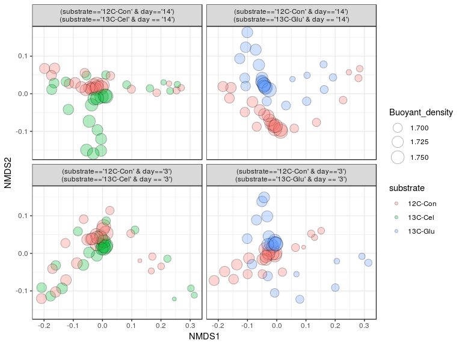
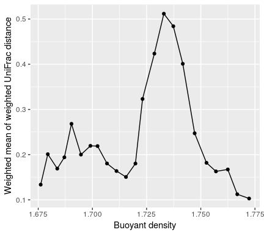
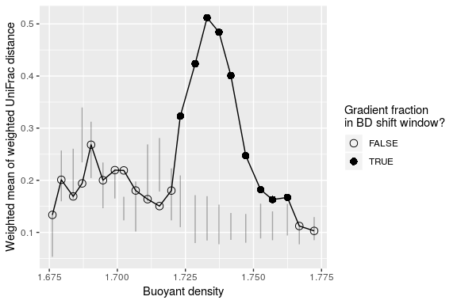
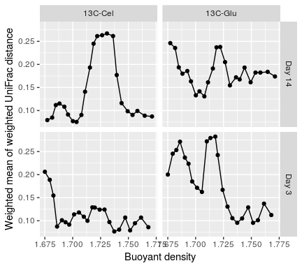
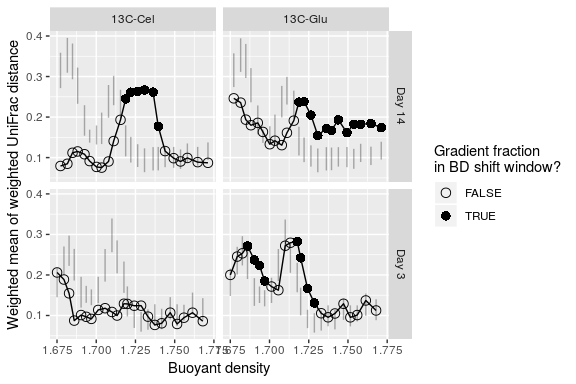

Examples of additional preliminary analyses
================
Samuel Barnett
May 31, 2019

-   [Introduction](#introduction)
-   [Beta-diversity across all fractions in treatment and controls](#beta-diversity-across-all-fractions-in-treatment-and-controls)
-   [Estimating community BD shift](#estimating-community-bd-shift)
-   [Session Info](#session-info)

Introduction
------------

There are many preliminary analyses that can be performed before running MW-HR-SIP. This tutorial goes through two simple examples, specifically, measuring beta-diversity between all fractions of the treatment and control and estimating the community level buoyant density shift. For an example on how to measure the beta-diversity between unfractionated samples of the treatment and control, see [Chapter\_Examples](Chapter_Examples.md). The files used in this tutorial can be found with this github site under the directory [example\_data](example_data/).

### R packages needed

``` r
# Packages needed for data handling
library(dplyr)
library(tidyr)
library(tibble)

# Packages needed for analysis
library(phyloseq)   # Used for handling our data format and wraping some functions found in other packages, mainly vegan
library(HTSSIP)     # Contains the main methods used in this analysis

# Packages needed for plotting
library(ggplot2)

# Packages used to make this Rmarkdown notebook look nice
library(knitr)
library(kableExtra)
```

Beta-diversity across all fractions in treatment and controls
-------------------------------------------------------------

Before running MW-HR-SIP, it is interesting to visualize the difference in community composition between fractions from the treatment and control samples. This can be a nice visual representation of how much the community composition differs when isotopically labeled OTUs shift across buoyant densities. The simple way to do this is to measure the UniFrac distance between all fractions from the treatment and control samples and plot these as an ordination.

As with all prevous examples, you can run this analyis with a single treatment-control sample pair or with multiple pairs. Below are examples of both.

### Single treatment-control pair

First here is an example of a simple code for visualizing the distance between all fractions from a single treatment-control sample pair. In this case, you have a single phyloseq just as in [Chapter\_Examples](Chapter_Examples.md). The following uses custom code which can be changed to suit your needs or coding style.

#### 1. Import the data

As with [Chapter\_Examples](Chapter_Examples.md) you will use the data found in file "SIP\_phyloseq.rds".

``` r
# Import the data you using the readRDS() function
S1D1.SIP.physeq <- readRDS("example_data/SIP_phyloseq.rds")

# What does this phyloseq object look like?
S1D1.SIP.physeq
```

    ## phyloseq-class experiment-level object
    ## otu_table()   OTU Table:         [ 8102 taxa and 47 samples ]
    ## sample_data() Sample Data:       [ 47 samples by 5 sample variables ]
    ## tax_table()   Taxonomy Table:    [ 8102 taxa by 7 taxonomic ranks ]
    ## phy_tree()    Phylogenetic Tree: [ 8102 tips and 8101 internal nodes ]

#### 2. Rarefy the read counts to an even depth:

Before measuring the beta diversity you need to account for differences in sequencing depth between samples. One common way to do this is by rarefying to an equal depth. There are a number of other ways to do this as well.

``` r
# Before you rarefy, it is good to set the seed so that you can replicate this somewhat stochastic step. Note this was not shown in the chapter.
set.seed(4242)

# Rarefy the data in each of the contrasts.
S1D1.SIP.physeq.rare <- rarefy_even_depth(S1D1.SIP.physeq)

# Now what does this phyloseq object look like?
S1D1.SIP.physeq.rare
```

    ## phyloseq-class experiment-level object
    ## otu_table()   OTU Table:         [ 5475 taxa and 47 samples ]
    ## sample_data() Sample Data:       [ 47 samples by 5 sample variables ]
    ## tax_table()   Taxonomy Table:    [ 5475 taxa by 7 taxonomic ranks ]
    ## phy_tree()    Phylogenetic Tree: [ 5475 tips and 5474 internal nodes ]

#### 3. Calculate NMDS coordinates for ordination of UniFrac distances

Now you will use the function `ordinate()` from package `phyloseq` to get the ordination of all fractions from these two samples based on the weighted UniFrac distances. Other dissimilarity or distance metrics can be used instead by setting the flag `distance` to another metric such as `bray` for Bray-Curtis.

``` r
# This is another step that is stochastic so we need to set the seed in order for this to be replicated.
set.seed(4242)

# Generate NMDS ordination profile of samples
bray.ord <- ordinate(S1D1.SIP.physeq.rare, "NMDS", distance="unifrac", weighted = TRUE)

# Convert this into a dataframe so it is easier to plot with ggplot2
bray.ord.df <- data.frame(bray.ord$points) %>%
  rownames_to_column(var="Sample_ID") %>%
  inner_join(data.frame(sample_data(S1D1.SIP.physeq.rare), stringsAsFactors=F), by = "Sample_ID")
```

#### 4. Plot ordination

Now you can plot the ordination with ggplot2.

``` r
ggplot(data=bray.ord.df, aes(x=MDS1, y=MDS2, color=substrate, fill=substrate, size=Buoyant_density)) +
  geom_point(shape=21, alpha=.3) +
  labs(x="NMDS 1", y="NMDS 2", color="Sample Type", fill="Sample Type", size="Buoyant density") +
  scale_color_manual(values=c("blue", "red")) +
  scale_fill_manual(values=c("blue", "red"))
```



### Multiple treatments and controls

With most real studies you will have multiple treatment samples and corresponding controls. HTSSIP has a handy function to do the above analysis but on multiple treatment-control pairs at once. This example will use the same dataset as in [HRSIP\_multiple\_samples](HRSIP_multiple_samples.md). This dataset has two 13C labeling treatments over two sampling days, resulting in four treatment-control comparisons:

13C-Cellulose Day 3 vs. 12C-Control Day 3 13C-Glucose Day 3 vs. 12C-Control Day 3 13C-Cellulose Day 14 vs. 12C-Control Day 14 13C-Glucose Day 14 vs. 12C-Control Day 14

#### 1. Import data

The dataset for this example is called "example\_S2D2\_phyloseq.rds". As before this is an R object containing the data in phyloseq format.

``` r
# Import the data you using the readRDS() function
S2D2.SIP.physeq <- readRDS("example_data/example_S2D2_phyloseq.rds")

# What does this phyloseq object look like?
S2D2.SIP.physeq
```

    ## phyloseq-class experiment-level object
    ## otu_table()   OTU Table:         [ 10001 taxa and 139 samples ]
    ## sample_data() Sample Data:       [ 139 samples by 5 sample variables ]
    ## tax_table()   Taxonomy Table:    [ 10001 taxa by 8 taxonomic ranks ]
    ## phy_tree()    Phylogenetic Tree: [ 10001 tips and 10000 internal nodes ]

#### 2. Subset data by treatment-control comparisons

Currently all of the data is in one single phyloseq object. For the analysis you need separate phyloseq objects, each containing all the fractions for a single treatment and its corresponding control. As in [HRSIP\_multiple\_samples](HRSIP_multiple_samples.md), you can use the function `phyloseq_subset()` to split up your phyloseq into a list of 4 phyloseq, each matched by day and a single treatment-control combination.

You need to subset the data by `Substrate` and by `Day`. To do this you make an expression that tells the function how to pair up samples. You will use the expression:

`(substrate=='12C-Con' & day=='${day}') | (substrate=='${substrate}' & day=='${day}')`

This expression essentially means that you group samples with the same `day` value and with either `12C-Con` or a distinct other `substrate` value.

You also need a set of the different pairs of parameters that will be used to group samples. In this case all combinations of `substrate` and `day`. This needs to only include treatment samples, so you first remove `12C-Con` from the `substrate` options.

``` r
# Set up the treatment-control pairing expression
ex <- "(substrate=='12C-Con' & day=='${day}') | (substrate=='${substrate}' & day == '${day}')"

# Get a set of subsetting parameters for the treatment samples
params <- get_treatment_params(S2D2.SIP.physeq, c('substrate', 'day'), "substrate != '12C-Con'")

# Subset the data into a list of phyloseq objects, each for a different treatment-control comparison
S2D2.SIP.physeq.list <- phyloseq_subset(S2D2.SIP.physeq, params, ex)

# What does the resulting dataset look like?
S2D2.SIP.physeq.list
```

    ## $`(substrate=='12C-Con' & day=='3') | (substrate=='13C-Cel' & day == '3')`
    ## phyloseq-class experiment-level object
    ## otu_table()   OTU Table:         [ 10001 taxa and 46 samples ]
    ## sample_data() Sample Data:       [ 46 samples by 5 sample variables ]
    ## tax_table()   Taxonomy Table:    [ 10001 taxa by 8 taxonomic ranks ]
    ## phy_tree()    Phylogenetic Tree: [ 10001 tips and 10000 internal nodes ]
    ## 
    ## $`(substrate=='12C-Con' & day=='14') | (substrate=='13C-Cel' & day == '14')`
    ## phyloseq-class experiment-level object
    ## otu_table()   OTU Table:         [ 10001 taxa and 46 samples ]
    ## sample_data() Sample Data:       [ 46 samples by 5 sample variables ]
    ## tax_table()   Taxonomy Table:    [ 10001 taxa by 8 taxonomic ranks ]
    ## phy_tree()    Phylogenetic Tree: [ 10001 tips and 10000 internal nodes ]
    ## 
    ## $`(substrate=='12C-Con' & day=='14') | (substrate=='13C-Glu' & day == '14')`
    ## phyloseq-class experiment-level object
    ## otu_table()   OTU Table:         [ 10001 taxa and 47 samples ]
    ## sample_data() Sample Data:       [ 47 samples by 5 sample variables ]
    ## tax_table()   Taxonomy Table:    [ 10001 taxa by 8 taxonomic ranks ]
    ## phy_tree()    Phylogenetic Tree: [ 10001 tips and 10000 internal nodes ]
    ## 
    ## $`(substrate=='12C-Con' & day=='3') | (substrate=='13C-Glu' & day == '3')`
    ## phyloseq-class experiment-level object
    ## otu_table()   OTU Table:         [ 10001 taxa and 46 samples ]
    ## sample_data() Sample Data:       [ 46 samples by 5 sample variables ]
    ## tax_table()   Taxonomy Table:    [ 10001 taxa by 8 taxonomic ranks ]
    ## phy_tree()    Phylogenetic Tree: [ 10001 tips and 10000 internal nodes ]

As you can see you now have a list of 4 phyloseq objects, each containing a separate treatment and control sample set. Each list entry is named by the comparison being made. Now you can see how the expression you created above split up the phyloseq object.

#### 3. Calculate NMDS coordinates for ordination of UniFrac distances

This time you will use the function `SIP_betaDiv_ord()` to calculate the coordinates for an NMDS ordination based on UniFrac distance. This is similar to what you did before but runs on a list of phyloseq objects. Different dissimilarity or distance metrics can be used in this step as well.

This step can also be run with parallel processing for systems with multiple cores. To run in parallel you need to set the number of threads with function `registerDoParallel()` from package `doParallel` then set the flag `parallel = TRUE` in `SIP_betaDiv_ord()`.

``` r
# Calculate ordination coordinates
S2D2.SIP.physeq.ord.df <- SIP_betaDiv_ord(S2D2.SIP.physeq.list, method = 'unifrac', weighted = TRUE)

# Modify entries into variable phyloseq_subset to make them easier to read. This just helps for visualization later and is not really necessary.
S2D2.SIP.physeq.ord.df$phyloseq_subset <- gsub(" \\| ", "\n", S2D2.SIP.physeq.ord.df$phyloseq_subset)
```

#### 4. Plot ordination

Now you can plot the ordinations. The function `phyloseq_ord_plot()` from package `HTSSIP` can be used for plotting or a similar code using ggplot2 can be writen as before. Be sure to look at the various usages for this function before plotting. Specifically, you will need to indicate graphical varaibles such as point sizes, shapes, and fill colors.

``` r
phyloseq_ord_plot(S2D2.SIP.physeq.ord.df, 
                  point_size = "Buoyant_density", 
                  point_fill = "substrate",
                  point_alpha = 0.3)
```



Estimating community BD shift
-----------------------------

The previous examples show how to observe the difference in community composition between fractions of the treatment and control samples. However, they don't give you much of an idea of the amount of community level shift in buoyant density (i.e. a quantification of how much the community shifts across the gradient due to isotopic lableing). One reason why it is hard to measure this is that the buoyant densities of each fraction differ slightly between the treatment and control. This is a normal occurance as separation of fractions differ slightly between each run. The following code estimates the community compositional difference between treatment and control samples across the gradients, correcting for different buoyant densities between treatment and control samples. For a more detailed explination please see the [HTSSIP paper](https://journals.plos.org/plosone/article?id=10.1371/journal.pone.0189616) or the [BD shifts vignette](https://cran.r-project.org/web/packages/HTSSIP/vignettes/BD_shifts.html) on CRAN. In this analysis, you can observe community level buoyant denstity shifts as peaks in the Beta-diversity along the buoyant density range.

You can also use this analysis to estimate buoyant density windows you would expect significant BD shifts occur. This can help to determine which buoyant density windows to use when conducting the MW-HR-SIP analysis.

As with all prevous examples, you can run this analyis with a single treatment-control sample pair or with multiple pairs, both of which will be shown here.

### Single treatment-control pair

First, this is an example of code for visualizing BD shift and finding BD shift windows from a single treatment-control sample pair.

#### 1. Import the data

As with [Chapter\_Examples](Chapter_Examples.md) you will use the data found in file "SIP\_phyloseq.rds".

``` r
# Import the data you using the readRDS() function
S1D1.SIP.physeq <- readRDS("example_data/SIP_phyloseq.rds")

# What does this phyloseq object look like?
S1D1.SIP.physeq
```

    ## phyloseq-class experiment-level object
    ## otu_table()   OTU Table:         [ 8102 taxa and 47 samples ]
    ## sample_data() Sample Data:       [ 47 samples by 5 sample variables ]
    ## tax_table()   Taxonomy Table:    [ 8102 taxa by 7 taxonomic ranks ]
    ## phy_tree()    Phylogenetic Tree: [ 8102 tips and 8101 internal nodes ]

#### 2. Calculate BD shift

You can calculate the BD shift directly from this dataset using the function `BD_shift()`. The result is a dataframe of weighted Unifrac distances between the treatment and control samples across the full range of buoyant densities in the gradient as well as their bootstrapped confidence intervals. You can change the number of permutations used to generate the confidence intervals. High numbers of permutations yeild the best results but will take a while to run.

You will need to enter in an expression that indicates which fractions are from the control gradient. In this case you will use `ex = "substrate == '12C-Con'"` since the variable `substrate` differentiates the treatment and control samples.

This function requires two other variables to be present in your sample metadata. You need `Buoyant_density` to contain the buoyant densities for each fraction. The variable `Fraction` should contain the fraction number identifing each fraction. These variables need to be spelled exactly as stated, with the first letter capitalized.

``` r
# Rename the variable fraction to Fraction so that it conforms with the required input for BD_shift()
sample_data(S1D1.SIP.physeq) <- sample_data(S1D1.SIP.physeq) %>%
  rename(Fraction = fraction)

# Calculate BD shift
S1D1.BDshift.df <- BD_shift(S1D1.SIP.physeq, 
                           ex="substrate=='12C-Con'",
                           nperm=999)

# view the first 10 entries in the output dataframe
kable(head(S1D1.BDshift.df, n=10), "html") %>%
  kable_styling() %>%
  scroll_box(width = "100%", height="400px")
```

<table class="table" style="margin-left: auto; margin-right: auto;">
<thead>
<tr>
<th style="text-align:right;">
perm\_id
</th>
<th style="text-align:left;">
sample.x
</th>
<th style="text-align:right;">
distance
</th>
<th style="text-align:right;">
Replicate.x
</th>
<th style="text-align:left;">
IS\_\_CONTROL.x
</th>
<th style="text-align:right;">
BD\_min.x
</th>
<th style="text-align:right;">
BD\_max.x
</th>
<th style="text-align:right;">
BD\_range.x
</th>
<th style="text-align:right;">
perc\_overlap
</th>
<th style="text-align:right;">
n\_over\_fracs
</th>
<th style="text-align:right;">
wmean\_dist
</th>
<th style="text-align:right;">
wmean\_dist\_CI\_low\_global
</th>
<th style="text-align:right;">
wmean\_dist\_CI\_high\_global
</th>
<th style="text-align:right;">
wmean\_dist\_CI\_low
</th>
<th style="text-align:right;">
wmean\_dist\_CI\_high
</th>
</tr>
</thead>
<tbody>
<tr>
<td style="text-align:right;">
0
</td>
<td style="text-align:left;">
12C-Con.Frac6
</td>
<td style="text-align:right;">
0.0920465
</td>
<td style="text-align:right;">
1
</td>
<td style="text-align:left;">
TRUE
</td>
<td style="text-align:right;">
1.766835
</td>
<td style="text-align:right;">
1.772298
</td>
<td style="text-align:right;">
0.005463
</td>
<td style="text-align:right;">
19.98902
</td>
<td style="text-align:right;">
2
</td>
<td style="text-align:right;">
0.1123091
</td>
<td style="text-align:right;">
0.0842729
</td>
<td style="text-align:right;">
0.2738066
</td>
<td style="text-align:right;">
0.0772339
</td>
<td style="text-align:right;">
0.1143847
</td>
</tr>
<tr>
<td style="text-align:right;">
0
</td>
<td style="text-align:left;">
12C-Con.Frac5
</td>
<td style="text-align:right;">
0.1029166
</td>
<td style="text-align:right;">
1
</td>
<td style="text-align:left;">
TRUE
</td>
<td style="text-align:right;">
1.772298
</td>
<td style="text-align:right;">
1.776669
</td>
<td style="text-align:right;">
0.004371
</td>
<td style="text-align:right;">
75.01716
</td>
<td style="text-align:right;">
1
</td>
<td style="text-align:right;">
0.1029166
</td>
<td style="text-align:right;">
0.0842729
</td>
<td style="text-align:right;">
0.2738066
</td>
<td style="text-align:right;">
0.0851029
</td>
<td style="text-align:right;">
0.1293953
</td>
</tr>
<tr>
<td style="text-align:right;">
0
</td>
<td style="text-align:left;">
12C-Con.Frac27
</td>
<td style="text-align:right;">
0.1336088
</td>
<td style="text-align:right;">
1
</td>
<td style="text-align:left;">
TRUE
</td>
<td style="text-align:right;">
1.676135
</td>
<td style="text-align:right;">
1.679414
</td>
<td style="text-align:right;">
0.003279
</td>
<td style="text-align:right;">
100.00000
</td>
<td style="text-align:right;">
1
</td>
<td style="text-align:right;">
0.1336088
</td>
<td style="text-align:right;">
0.0842729
</td>
<td style="text-align:right;">
0.2738066
</td>
<td style="text-align:right;">
0.0532617
</td>
<td style="text-align:right;">
0.1349032
</td>
</tr>
<tr>
<td style="text-align:right;">
0
</td>
<td style="text-align:left;">
12C-Con.Frac24
</td>
<td style="text-align:right;">
0.2284841
</td>
<td style="text-align:right;">
1
</td>
<td style="text-align:left;">
TRUE
</td>
<td style="text-align:right;">
1.687063
</td>
<td style="text-align:right;">
1.690341
</td>
<td style="text-align:right;">
0.003278
</td>
<td style="text-align:right;">
33.31300
</td>
<td style="text-align:right;">
2
</td>
<td style="text-align:right;">
0.1940472
</td>
<td style="text-align:right;">
0.0842729
</td>
<td style="text-align:right;">
0.2738066
</td>
<td style="text-align:right;">
0.2344390
</td>
<td style="text-align:right;">
0.3396537
</td>
</tr>
<tr>
<td style="text-align:right;">
0
</td>
<td style="text-align:left;">
12C-Con.Frac23
</td>
<td style="text-align:right;">
0.3091499
</td>
<td style="text-align:right;">
1
</td>
<td style="text-align:left;">
TRUE
</td>
<td style="text-align:right;">
1.690341
</td>
<td style="text-align:right;">
1.694712
</td>
<td style="text-align:right;">
0.004371
</td>
<td style="text-align:right;">
75.01716
</td>
<td style="text-align:right;">
2
</td>
<td style="text-align:right;">
0.2681441
</td>
<td style="text-align:right;">
0.0842729
</td>
<td style="text-align:right;">
0.2738066
</td>
<td style="text-align:right;">
0.2043624
</td>
<td style="text-align:right;">
0.3123738
</td>
</tr>
<tr>
<td style="text-align:right;">
0
</td>
<td style="text-align:left;">
12C-Con.Frac25
</td>
<td style="text-align:right;">
0.1593477
</td>
<td style="text-align:right;">
1
</td>
<td style="text-align:left;">
TRUE
</td>
<td style="text-align:right;">
1.683785
</td>
<td style="text-align:right;">
1.687063
</td>
<td style="text-align:right;">
0.003278
</td>
<td style="text-align:right;">
33.34350
</td>
<td style="text-align:right;">
2
</td>
<td style="text-align:right;">
0.1690682
</td>
<td style="text-align:right;">
0.0842729
</td>
<td style="text-align:right;">
0.2738066
</td>
<td style="text-align:right;">
0.1643111
</td>
<td style="text-align:right;">
0.2605156
</td>
</tr>
<tr>
<td style="text-align:right;">
0
</td>
<td style="text-align:left;">
12C-Con.Frac12
</td>
<td style="text-align:right;">
0.5072570
</td>
<td style="text-align:right;">
1
</td>
<td style="text-align:left;">
TRUE
</td>
<td style="text-align:right;">
1.737330
</td>
<td style="text-align:right;">
1.741701
</td>
<td style="text-align:right;">
0.004371
</td>
<td style="text-align:right;">
25.00572
</td>
<td style="text-align:right;">
2
</td>
<td style="text-align:right;">
0.4840737
</td>
<td style="text-align:right;">
0.0842729
</td>
<td style="text-align:right;">
0.2738066
</td>
<td style="text-align:right;">
0.0773273
</td>
<td style="text-align:right;">
0.1533306
</td>
</tr>
<tr>
<td style="text-align:right;">
0
</td>
<td style="text-align:left;">
12C-Con.Frac13
</td>
<td style="text-align:right;">
0.5117822
</td>
<td style="text-align:right;">
1
</td>
<td style="text-align:left;">
TRUE
</td>
<td style="text-align:right;">
1.732959
</td>
<td style="text-align:right;">
1.737330
</td>
<td style="text-align:right;">
0.004371
</td>
<td style="text-align:right;">
100.00000
</td>
<td style="text-align:right;">
1
</td>
<td style="text-align:right;">
0.5117822
</td>
<td style="text-align:right;">
0.0842729
</td>
<td style="text-align:right;">
0.2738066
</td>
<td style="text-align:right;">
0.0844899
</td>
<td style="text-align:right;">
0.1695065
</td>
</tr>
<tr>
<td style="text-align:right;">
0
</td>
<td style="text-align:left;">
12C-Con.Frac26
</td>
<td style="text-align:right;">
0.1771359
</td>
<td style="text-align:right;">
1
</td>
<td style="text-align:left;">
TRUE
</td>
<td style="text-align:right;">
1.679414
</td>
<td style="text-align:right;">
1.683785
</td>
<td style="text-align:right;">
0.004371
</td>
<td style="text-align:right;">
50.01144
</td>
<td style="text-align:right;">
2
</td>
<td style="text-align:right;">
0.2009761
</td>
<td style="text-align:right;">
0.0842729
</td>
<td style="text-align:right;">
0.2738066
</td>
<td style="text-align:right;">
0.1597188
</td>
<td style="text-align:right;">
0.2571375
</td>
</tr>
<tr>
<td style="text-align:right;">
0
</td>
<td style="text-align:left;">
12C-Con.Frac10
</td>
<td style="text-align:right;">
0.2472486
</td>
<td style="text-align:right;">
1
</td>
<td style="text-align:left;">
TRUE
</td>
<td style="text-align:right;">
1.747165
</td>
<td style="text-align:right;">
1.752629
</td>
<td style="text-align:right;">
0.005464
</td>
<td style="text-align:right;">
100.00000
</td>
<td style="text-align:right;">
1
</td>
<td style="text-align:right;">
0.2472486
</td>
<td style="text-align:right;">
0.0842729
</td>
<td style="text-align:right;">
0.2738066
</td>
<td style="text-align:right;">
0.0802284
</td>
<td style="text-align:right;">
0.1354191
</td>
</tr>
</tbody>
</table>

#### 3. Plot inital results

Now you can plot these initial results to see how the Beta-diversity between treatment and control communities shifts across buoyant density.

``` r
ggplot(S1D1.BDshift.df, aes(BD_min.x, wmean_dist)) +
  geom_line() +
  geom_point() +
  labs(x="Buoyant density", 
       y="Weighted mean of weighted UniFrac distance")
```



#### 4. Identify BD shift windows

Now that you have the weighted UniFrac distance between treatment and control across the gradient and bootstrapped confidence intervals, you can identify ranges of buoyant density where the distance is larger than expected under a null model. This means, if at a particular buoyant density, the treatment and control communities are more different than expected under a null model, there is a significant BD shift in some of the OTUs within that window.

You can specify how many consecutive buoyant density points should constitue a window. In this case, 3 consecutive buoyant densities with treatment and control communities more dissimilary than expected under the null model constitue a window.

``` r
# Calculate if there is a BD shift for each buoyant density
S1D1.BDshift.df <- S1D1.BDshift.df %>%
  mutate(BD_shift = wmean_dist > wmean_dist_CI_high) %>%
  arrange(BD_min.x) %>%
  mutate(window = (BD_shift == TRUE & lag(BD_shift) == TRUE & lag(BD_shift, 2) == TRUE) |
                  (BD_shift == TRUE & lag(BD_shift) == TRUE & lead(BD_shift) == TRUE) |
                  (BD_shift == TRUE & lead(BD_shift) == TRUE & lead(BD_shift, 2) == TRUE),
         BD_shift = BD_shift == TRUE & window == TRUE,
         BD_shift = ifelse(is.na(BD_shift), FALSE, BD_shift))

# View the first 10 buoyant densities where a BD shift is indicated
kable(head(S1D1.BDshift.df[S1D1.BDshift.df$BD_shift == "TRUE",], n=10), "html") %>%
  kable_styling() %>%
  scroll_box(width = "100%", height="400px")
```

<table class="table" style="margin-left: auto; margin-right: auto;">
<thead>
<tr>
<th style="text-align:left;">
</th>
<th style="text-align:right;">
perm\_id
</th>
<th style="text-align:left;">
sample.x
</th>
<th style="text-align:right;">
distance
</th>
<th style="text-align:right;">
Replicate.x
</th>
<th style="text-align:left;">
IS\_\_CONTROL.x
</th>
<th style="text-align:right;">
BD\_min.x
</th>
<th style="text-align:right;">
BD\_max.x
</th>
<th style="text-align:right;">
BD\_range.x
</th>
<th style="text-align:right;">
perc\_overlap
</th>
<th style="text-align:right;">
n\_over\_fracs
</th>
<th style="text-align:right;">
wmean\_dist
</th>
<th style="text-align:right;">
wmean\_dist\_CI\_low\_global
</th>
<th style="text-align:right;">
wmean\_dist\_CI\_high\_global
</th>
<th style="text-align:right;">
wmean\_dist\_CI\_low
</th>
<th style="text-align:right;">
wmean\_dist\_CI\_high
</th>
<th style="text-align:left;">
BD\_shift
</th>
<th style="text-align:left;">
window
</th>
</tr>
</thead>
<tbody>
<tr>
<td style="text-align:left;">
13
</td>
<td style="text-align:right;">
0
</td>
<td style="text-align:left;">
12C-Con.Frac15
</td>
<td style="text-align:right;">
0.2216181
</td>
<td style="text-align:right;">
1
</td>
<td style="text-align:left;">
TRUE
</td>
<td style="text-align:right;">
1.723124
</td>
<td style="text-align:right;">
1.728588
</td>
<td style="text-align:right;">
0.005464
</td>
<td style="text-align:right;">
40.00732
</td>
<td style="text-align:right;">
2
</td>
<td style="text-align:right;">
0.3231281
</td>
<td style="text-align:right;">
0.0842729
</td>
<td style="text-align:right;">
0.2738066
</td>
<td style="text-align:right;">
0.1100911
</td>
<td style="text-align:right;">
0.2093446
</td>
<td style="text-align:left;">
TRUE
</td>
<td style="text-align:left;">
TRUE
</td>
</tr>
<tr>
<td style="text-align:left;">
14
</td>
<td style="text-align:right;">
0
</td>
<td style="text-align:left;">
12C-Con.Frac14
</td>
<td style="text-align:right;">
0.3764652
</td>
<td style="text-align:right;">
1
</td>
<td style="text-align:left;">
TRUE
</td>
<td style="text-align:right;">
1.728588
</td>
<td style="text-align:right;">
1.732959
</td>
<td style="text-align:right;">
0.004371
</td>
<td style="text-align:right;">
49.98856
</td>
<td style="text-align:right;">
2
</td>
<td style="text-align:right;">
0.4235023
</td>
<td style="text-align:right;">
0.0842729
</td>
<td style="text-align:right;">
0.2738066
</td>
<td style="text-align:right;">
0.0796771
</td>
<td style="text-align:right;">
0.1714286
</td>
<td style="text-align:left;">
TRUE
</td>
<td style="text-align:left;">
TRUE
</td>
</tr>
<tr>
<td style="text-align:left;">
15
</td>
<td style="text-align:right;">
0
</td>
<td style="text-align:left;">
12C-Con.Frac13
</td>
<td style="text-align:right;">
0.5117822
</td>
<td style="text-align:right;">
1
</td>
<td style="text-align:left;">
TRUE
</td>
<td style="text-align:right;">
1.732959
</td>
<td style="text-align:right;">
1.737330
</td>
<td style="text-align:right;">
0.004371
</td>
<td style="text-align:right;">
100.00000
</td>
<td style="text-align:right;">
1
</td>
<td style="text-align:right;">
0.5117822
</td>
<td style="text-align:right;">
0.0842729
</td>
<td style="text-align:right;">
0.2738066
</td>
<td style="text-align:right;">
0.0844899
</td>
<td style="text-align:right;">
0.1695065
</td>
<td style="text-align:left;">
TRUE
</td>
<td style="text-align:left;">
TRUE
</td>
</tr>
<tr>
<td style="text-align:left;">
16
</td>
<td style="text-align:right;">
0
</td>
<td style="text-align:left;">
12C-Con.Frac12
</td>
<td style="text-align:right;">
0.5072570
</td>
<td style="text-align:right;">
1
</td>
<td style="text-align:left;">
TRUE
</td>
<td style="text-align:right;">
1.737330
</td>
<td style="text-align:right;">
1.741701
</td>
<td style="text-align:right;">
0.004371
</td>
<td style="text-align:right;">
25.00572
</td>
<td style="text-align:right;">
2
</td>
<td style="text-align:right;">
0.4840737
</td>
<td style="text-align:right;">
0.0842729
</td>
<td style="text-align:right;">
0.2738066
</td>
<td style="text-align:right;">
0.0773273
</td>
<td style="text-align:right;">
0.1533306
</td>
<td style="text-align:left;">
TRUE
</td>
<td style="text-align:left;">
TRUE
</td>
</tr>
<tr>
<td style="text-align:left;">
17
</td>
<td style="text-align:right;">
0
</td>
<td style="text-align:left;">
12C-Con.Frac11
</td>
<td style="text-align:right;">
0.4009301
</td>
<td style="text-align:right;">
1
</td>
<td style="text-align:left;">
TRUE
</td>
<td style="text-align:right;">
1.741701
</td>
<td style="text-align:right;">
1.747165
</td>
<td style="text-align:right;">
0.005464
</td>
<td style="text-align:right;">
100.00000
</td>
<td style="text-align:right;">
1
</td>
<td style="text-align:right;">
0.4009301
</td>
<td style="text-align:right;">
0.0842729
</td>
<td style="text-align:right;">
0.2738066
</td>
<td style="text-align:right;">
0.0857543
</td>
<td style="text-align:right;">
0.1373480
</td>
<td style="text-align:left;">
TRUE
</td>
<td style="text-align:left;">
TRUE
</td>
</tr>
<tr>
<td style="text-align:left;">
18
</td>
<td style="text-align:right;">
0
</td>
<td style="text-align:left;">
12C-Con.Frac10
</td>
<td style="text-align:right;">
0.2472486
</td>
<td style="text-align:right;">
1
</td>
<td style="text-align:left;">
TRUE
</td>
<td style="text-align:right;">
1.747165
</td>
<td style="text-align:right;">
1.752629
</td>
<td style="text-align:right;">
0.005464
</td>
<td style="text-align:right;">
100.00000
</td>
<td style="text-align:right;">
1
</td>
<td style="text-align:right;">
0.2472486
</td>
<td style="text-align:right;">
0.0842729
</td>
<td style="text-align:right;">
0.2738066
</td>
<td style="text-align:right;">
0.0802284
</td>
<td style="text-align:right;">
0.1354191
</td>
<td style="text-align:left;">
TRUE
</td>
<td style="text-align:left;">
TRUE
</td>
</tr>
<tr>
<td style="text-align:left;">
19
</td>
<td style="text-align:right;">
0
</td>
<td style="text-align:left;">
12C-Con.Frac9
</td>
<td style="text-align:right;">
0.1819037
</td>
<td style="text-align:right;">
1
</td>
<td style="text-align:left;">
TRUE
</td>
<td style="text-align:right;">
1.752629
</td>
<td style="text-align:right;">
1.757000
</td>
<td style="text-align:right;">
0.004371
</td>
<td style="text-align:right;">
100.00000
</td>
<td style="text-align:right;">
1
</td>
<td style="text-align:right;">
0.1819037
</td>
<td style="text-align:right;">
0.0842729
</td>
<td style="text-align:right;">
0.2738066
</td>
<td style="text-align:right;">
0.0884247
</td>
<td style="text-align:right;">
0.1551922
</td>
<td style="text-align:left;">
TRUE
</td>
<td style="text-align:left;">
TRUE
</td>
</tr>
<tr>
<td style="text-align:left;">
20
</td>
<td style="text-align:right;">
0
</td>
<td style="text-align:left;">
12C-Con.Frac8
</td>
<td style="text-align:right;">
0.1629261
</td>
<td style="text-align:right;">
1
</td>
<td style="text-align:left;">
TRUE
</td>
<td style="text-align:right;">
1.757000
</td>
<td style="text-align:right;">
1.762464
</td>
<td style="text-align:right;">
0.005464
</td>
<td style="text-align:right;">
100.00000
</td>
<td style="text-align:right;">
1
</td>
<td style="text-align:right;">
0.1629261
</td>
<td style="text-align:right;">
0.0842729
</td>
<td style="text-align:right;">
0.2738066
</td>
<td style="text-align:right;">
0.0849887
</td>
<td style="text-align:right;">
0.1403509
</td>
<td style="text-align:left;">
TRUE
</td>
<td style="text-align:left;">
TRUE
</td>
</tr>
<tr>
<td style="text-align:left;">
21
</td>
<td style="text-align:right;">
0
</td>
<td style="text-align:left;">
12C-Con.Frac7
</td>
<td style="text-align:right;">
0.1671897
</td>
<td style="text-align:right;">
1
</td>
<td style="text-align:left;">
TRUE
</td>
<td style="text-align:right;">
1.762464
</td>
<td style="text-align:right;">
1.766835
</td>
<td style="text-align:right;">
0.004371
</td>
<td style="text-align:right;">
100.00000
</td>
<td style="text-align:right;">
1
</td>
<td style="text-align:right;">
0.1671897
</td>
<td style="text-align:right;">
0.0842729
</td>
<td style="text-align:right;">
0.2738066
</td>
<td style="text-align:right;">
0.0940674
</td>
<td style="text-align:right;">
0.1549739
</td>
<td style="text-align:left;">
TRUE
</td>
<td style="text-align:left;">
TRUE
</td>
</tr>
</tbody>
</table>

#### 3. Plot inital results

It's easier to identify the BD shift windows when you plot the data, rather than reading the table.

``` r
ggplot(S1D1.BDshift.df, aes(BD_min.x, wmean_dist)) +
  geom_line() +
  geom_linerange(aes(ymin=wmean_dist_CI_low, 
                     ymax=wmean_dist_CI_high),
                 alpha=0.3) +
  geom_point(aes(shape=BD_shift), size=3) +
  scale_shape_manual('Gradient fraction\nin BD shift window?', values=c(21,16)) +
  labs(x="Buoyant density", 
       y="Weighted mean of weighted UniFrac distance")
```



Now you can clearly see which buoyant densities across the gradient are within a BD shift window. To use this for your MW-HR-SIP windows, you can split this large contiguous window into multiple overlapping windows. Be sure to check that at least 3 fractions each from your treatment and control gradients are found in each window.

### Multiple treatments and controls

Finally, the following is an example of code for visualizing BD shift and finding BD shift windows from multiple treatment-control sample pairs.

#### 1. Import data

The dataset for this example is the same as before, "example\_S2D2\_phyloseq.rds".

``` r
# Import the data you using the readRDS() function
S2D2.SIP.physeq <- readRDS("example_data/example_S2D2_phyloseq.rds")

# What does this phyloseq object look like?
S2D2.SIP.physeq
```

    ## phyloseq-class experiment-level object
    ## otu_table()   OTU Table:         [ 10001 taxa and 139 samples ]
    ## sample_data() Sample Data:       [ 139 samples by 5 sample variables ]
    ## tax_table()   Taxonomy Table:    [ 10001 taxa by 8 taxonomic ranks ]
    ## phy_tree()    Phylogenetic Tree: [ 10001 tips and 10000 internal nodes ]

##### 2. Subset data by treatment-control comparisons

Currently all of the data is in one single phyloseq object. Just as before, for the analysis you need separate phyloseq objects, each containing all the fractions for a single treatment and its corresponding control. As in [HRSIP\_multiple\_samples](HRSIP_multiple_samples.md), you can use the function `phyloseq_subset()` to split up your phyloseq into a list of 4 phyloseq, each matched by day and a single treatment-control combination.

You need to subset the data by `Substrate` and by `Day`. To do this you make an expression that tells the function how to pair up samples. You will use the expression:

`(substrate=='12C-Con' & day=='${day}') | (substrate=='${substrate}' & day=='${day}')`

This expression essentially means that you group samples with the same `day` value and with either `12C-Con` or a distinct other `substrate` value.

You also need a set of the different pairs of parameters that will be used to group samples. In this case all combinations of `substrate` and `day`. This needs to only include treatment samples, so you first remove `12C-Con` from the `substrate` options.

Additionally as before, the `BD_shift()` function requires two variables to be present in your sample metadata. You need `Buoyant_density` to contain the buoyant densities for each sample. You also need `Fraction` to contain the fraction number for each sample. In the example data, `Fraction` is spelled with a lower case. Before continuing you will change the variable names.

``` r
# Rename the variable "fraction"" to "Fraction"" so that it conforms with the required input for BD_shift()
sample_data(S2D2.SIP.physeq) <- sample_data(S2D2.SIP.physeq) %>%
    rename(Fraction = fraction)

# Set up the treatment-control pairing expression
ex <- "(substrate=='12C-Con' & day=='${day}') | (substrate=='${substrate}' & day == '${day}')"

# Get a set of subsetting parameters for the treatment samples
params <- get_treatment_params(S2D2.SIP.physeq, c('substrate', 'day'), "substrate != '12C-Con'")

# Subset the data into a list of phyloseq objects, each for a different treatment-control comparison
S2D2.SIP.physeq.list <- phyloseq_subset(S2D2.SIP.physeq, params, ex)

# What does the resulting dataset look like?
S2D2.SIP.physeq.list
```

    ## $`(substrate=='12C-Con' & day=='3') | (substrate=='13C-Cel' & day == '3')`
    ## phyloseq-class experiment-level object
    ## otu_table()   OTU Table:         [ 10001 taxa and 46 samples ]
    ## sample_data() Sample Data:       [ 46 samples by 5 sample variables ]
    ## tax_table()   Taxonomy Table:    [ 10001 taxa by 8 taxonomic ranks ]
    ## phy_tree()    Phylogenetic Tree: [ 10001 tips and 10000 internal nodes ]
    ## 
    ## $`(substrate=='12C-Con' & day=='14') | (substrate=='13C-Cel' & day == '14')`
    ## phyloseq-class experiment-level object
    ## otu_table()   OTU Table:         [ 10001 taxa and 46 samples ]
    ## sample_data() Sample Data:       [ 46 samples by 5 sample variables ]
    ## tax_table()   Taxonomy Table:    [ 10001 taxa by 8 taxonomic ranks ]
    ## phy_tree()    Phylogenetic Tree: [ 10001 tips and 10000 internal nodes ]
    ## 
    ## $`(substrate=='12C-Con' & day=='14') | (substrate=='13C-Glu' & day == '14')`
    ## phyloseq-class experiment-level object
    ## otu_table()   OTU Table:         [ 10001 taxa and 47 samples ]
    ## sample_data() Sample Data:       [ 47 samples by 5 sample variables ]
    ## tax_table()   Taxonomy Table:    [ 10001 taxa by 8 taxonomic ranks ]
    ## phy_tree()    Phylogenetic Tree: [ 10001 tips and 10000 internal nodes ]
    ## 
    ## $`(substrate=='12C-Con' & day=='3') | (substrate=='13C-Glu' & day == '3')`
    ## phyloseq-class experiment-level object
    ## otu_table()   OTU Table:         [ 10001 taxa and 46 samples ]
    ## sample_data() Sample Data:       [ 46 samples by 5 sample variables ]
    ## tax_table()   Taxonomy Table:    [ 10001 taxa by 8 taxonomic ranks ]
    ## phy_tree()    Phylogenetic Tree: [ 10001 tips and 10000 internal nodes ]

#### 2. Calculate BD shift

You can calculate the BD shift from this modified dataset using the function `BD_shift()`. The result is a dataframe of weighted UniFrac distances between treatment and control samples across the full range of buoyant densities, as well as their bootstrapped confidence intervals. You can change the number of permutations used to generate the confidence intervals. High numbers of permutations yeild the best results but will take a while, especially now that you are iterating across multiple treatment-control pairs.

You will need to enter in an expression that indicates which fractions are from the control gradient. In this case you will use `ex = "substrate == '12C-Con'"` since the variable `substrate` differentiates the treatment and control samples.

Since you are using a list of phyloseq objects this time, you need to run `BD_shift()` iteratively over each phyloseq object in the list. You can do this using fucntion `ldply()` from package `plyr`. If using ldply, you can make this run a little faster by running multiple treatment-control pairs in parallel. To do this you need to set the flag `.parallel` to true after setting the number of threads you want to use with function `registerDoParallel()` from package `doParallel`. For more info see documentation for `ldply()`.

``` r
# Calculate BD shift
S2D2.BDshift.df <- plyr::ldply(S2D2.SIP.physeq.list, BD_shift, ex="substrate=='12C-Con'", nperm=999)

# Add variables day and substrate to make table comprehension the evential plots easier to read. This is not really necessary but helps.
S2D2.BDshift.df$day <- gsub('.+day==[ \']*([0-9]+).+', 'Day \\1', S2D2.BDshift.df$.id)
S2D2.BDshift.df$substrate <- gsub('.+(13C-[A-z]+).+', '\\1', S2D2.BDshift.df$.id)


# view the first 10 entries in the output dataframe
kable(head(S2D2.BDshift.df, n=10), "html") %>%
  kable_styling() %>%
  scroll_box(width = "100%", height="400px")
```

<table class="table" style="margin-left: auto; margin-right: auto;">
<thead>
<tr>
<th style="text-align:left;">
.id
</th>
<th style="text-align:right;">
perm\_id
</th>
<th style="text-align:left;">
sample.x
</th>
<th style="text-align:right;">
distance
</th>
<th style="text-align:right;">
Replicate.x
</th>
<th style="text-align:left;">
IS\_\_CONTROL.x
</th>
<th style="text-align:right;">
BD\_min.x
</th>
<th style="text-align:right;">
BD\_max.x
</th>
<th style="text-align:right;">
BD\_range.x
</th>
<th style="text-align:right;">
perc\_overlap
</th>
<th style="text-align:right;">
n\_over\_fracs
</th>
<th style="text-align:right;">
wmean\_dist
</th>
<th style="text-align:right;">
wmean\_dist\_CI\_low\_global
</th>
<th style="text-align:right;">
wmean\_dist\_CI\_high\_global
</th>
<th style="text-align:right;">
wmean\_dist\_CI\_low
</th>
<th style="text-align:right;">
wmean\_dist\_CI\_high
</th>
<th style="text-align:left;">
day
</th>
<th style="text-align:left;">
substrate
</th>
</tr>
</thead>
<tbody>
<tr>
<td style="text-align:left;">
(substrate=='12C-Con' & day=='3') | (substrate=='13C-Cel' & day == '3')
</td>
<td style="text-align:right;">
0
</td>
<td style="text-align:left;">
12C-Con.D3.R3\_F19
</td>
<td style="text-align:right;">
0.0886778
</td>
<td style="text-align:right;">
1
</td>
<td style="text-align:left;">
TRUE
</td>
<td style="text-align:right;">
1.705640
</td>
<td style="text-align:right;">
1.710011
</td>
<td style="text-align:right;">
0.004371
</td>
<td style="text-align:right;">
12.49142
</td>
<td style="text-align:right;">
2
</td>
<td style="text-align:right;">
0.1179129
</td>
<td style="text-align:right;">
0.0762333
</td>
<td style="text-align:right;">
0.2782169
</td>
<td style="text-align:right;">
0.1836358
</td>
<td style="text-align:right;">
0.2638224
</td>
<td style="text-align:left;">
Day 3
</td>
<td style="text-align:left;">
13C-Cel
</td>
</tr>
<tr>
<td style="text-align:left;">
(substrate=='12C-Con' & day=='3') | (substrate=='13C-Cel' & day == '3')
</td>
<td style="text-align:right;">
0
</td>
<td style="text-align:left;">
12C-Con.D3.R3\_F13
</td>
<td style="text-align:right;">
0.1242481
</td>
<td style="text-align:right;">
1
</td>
<td style="text-align:left;">
TRUE
</td>
<td style="text-align:right;">
1.728588
</td>
<td style="text-align:right;">
1.732959
</td>
<td style="text-align:right;">
0.004371
</td>
<td style="text-align:right;">
100.00000
</td>
<td style="text-align:right;">
1
</td>
<td style="text-align:right;">
0.1242481
</td>
<td style="text-align:right;">
0.0762333
</td>
<td style="text-align:right;">
0.2782169
</td>
<td style="text-align:right;">
0.0600536
</td>
<td style="text-align:right;">
0.1086192
</td>
<td style="text-align:left;">
Day 3
</td>
<td style="text-align:left;">
13C-Cel
</td>
</tr>
<tr>
<td style="text-align:left;">
(substrate=='12C-Con' & day=='3') | (substrate=='13C-Cel' & day == '3')
</td>
<td style="text-align:right;">
0
</td>
<td style="text-align:left;">
12C-Con.D3.R3\_F14
</td>
<td style="text-align:right;">
0.1305413
</td>
<td style="text-align:right;">
1
</td>
<td style="text-align:left;">
TRUE
</td>
<td style="text-align:right;">
1.724217
</td>
<td style="text-align:right;">
1.728588
</td>
<td style="text-align:right;">
0.004371
</td>
<td style="text-align:right;">
74.99428
</td>
<td style="text-align:right;">
2
</td>
<td style="text-align:right;">
0.1240763
</td>
<td style="text-align:right;">
0.0762333
</td>
<td style="text-align:right;">
0.2782169
</td>
<td style="text-align:right;">
0.0692708
</td>
<td style="text-align:right;">
0.1164436
</td>
<td style="text-align:left;">
Day 3
</td>
<td style="text-align:left;">
13C-Cel
</td>
</tr>
<tr>
<td style="text-align:left;">
(substrate=='12C-Con' & day=='3') | (substrate=='13C-Cel' & day == '3')
</td>
<td style="text-align:right;">
0
</td>
<td style="text-align:left;">
12C-Con.D3.R3\_F12
</td>
<td style="text-align:right;">
0.1245863
</td>
<td style="text-align:right;">
1
</td>
<td style="text-align:left;">
TRUE
</td>
<td style="text-align:right;">
1.732959
</td>
<td style="text-align:right;">
1.737330
</td>
<td style="text-align:right;">
0.004371
</td>
<td style="text-align:right;">
25.00572
</td>
<td style="text-align:right;">
3
</td>
<td style="text-align:right;">
0.0971842
</td>
<td style="text-align:right;">
0.0762333
</td>
<td style="text-align:right;">
0.2782169
</td>
<td style="text-align:right;">
0.0648721
</td>
<td style="text-align:right;">
0.1152808
</td>
<td style="text-align:left;">
Day 3
</td>
<td style="text-align:left;">
13C-Cel
</td>
</tr>
<tr>
<td style="text-align:left;">
(substrate=='12C-Con' & day=='3') | (substrate=='13C-Cel' & day == '3')
</td>
<td style="text-align:right;">
0
</td>
<td style="text-align:left;">
12C-Con.D3.R3\_F20
</td>
<td style="text-align:right;">
0.1137103
</td>
<td style="text-align:right;">
1
</td>
<td style="text-align:left;">
TRUE
</td>
<td style="text-align:right;">
1.701269
</td>
<td style="text-align:right;">
1.705640
</td>
<td style="text-align:right;">
0.004371
</td>
<td style="text-align:right;">
100.00000
</td>
<td style="text-align:right;">
1
</td>
<td style="text-align:right;">
0.1137103
</td>
<td style="text-align:right;">
0.0762333
</td>
<td style="text-align:right;">
0.2782169
</td>
<td style="text-align:right;">
0.1305202
</td>
<td style="text-align:right;">
0.1954852
</td>
<td style="text-align:left;">
Day 3
</td>
<td style="text-align:left;">
13C-Cel
</td>
</tr>
<tr>
<td style="text-align:left;">
(substrate=='12C-Con' & day=='3') | (substrate=='13C-Cel' & day == '3')
</td>
<td style="text-align:right;">
0
</td>
<td style="text-align:left;">
12C-Con.D3.R3\_F21
</td>
<td style="text-align:right;">
0.0828694
</td>
<td style="text-align:right;">
1
</td>
<td style="text-align:left;">
TRUE
</td>
<td style="text-align:right;">
1.696898
</td>
<td style="text-align:right;">
1.701269
</td>
<td style="text-align:right;">
0.004371
</td>
<td style="text-align:right;">
50.01144
</td>
<td style="text-align:right;">
2
</td>
<td style="text-align:right;">
0.0916203
</td>
<td style="text-align:right;">
0.0762333
</td>
<td style="text-align:right;">
0.2782169
</td>
<td style="text-align:right;">
0.1253378
</td>
<td style="text-align:right;">
0.1643218
</td>
<td style="text-align:left;">
Day 3
</td>
<td style="text-align:left;">
13C-Cel
</td>
</tr>
<tr>
<td style="text-align:left;">
(substrate=='12C-Con' & day=='3') | (substrate=='13C-Cel' & day == '3')
</td>
<td style="text-align:right;">
0
</td>
<td style="text-align:left;">
12C-Con.D3.R3\_F11
</td>
<td style="text-align:right;">
0.0831419
</td>
<td style="text-align:right;">
1
</td>
<td style="text-align:left;">
TRUE
</td>
<td style="text-align:right;">
1.737330
</td>
<td style="text-align:right;">
1.741701
</td>
<td style="text-align:right;">
0.004371
</td>
<td style="text-align:right;">
25.00572
</td>
<td style="text-align:right;">
2
</td>
<td style="text-align:right;">
0.0767336
</td>
<td style="text-align:right;">
0.0762333
</td>
<td style="text-align:right;">
0.2782169
</td>
<td style="text-align:right;">
0.0745899
</td>
<td style="text-align:right;">
0.1277357
</td>
<td style="text-align:left;">
Day 3
</td>
<td style="text-align:left;">
13C-Cel
</td>
</tr>
<tr>
<td style="text-align:left;">
(substrate=='12C-Con' & day=='3') | (substrate=='13C-Cel' & day == '3')
</td>
<td style="text-align:right;">
0
</td>
<td style="text-align:left;">
12C-Con.D3.R3\_F15
</td>
<td style="text-align:right;">
0.1136050
</td>
<td style="text-align:right;">
1
</td>
<td style="text-align:left;">
TRUE
</td>
<td style="text-align:right;">
1.719846
</td>
<td style="text-align:right;">
1.724217
</td>
<td style="text-align:right;">
0.004371
</td>
<td style="text-align:right;">
12.51430
</td>
<td style="text-align:right;">
3
</td>
<td style="text-align:right;">
0.1285688
</td>
<td style="text-align:right;">
0.0762333
</td>
<td style="text-align:right;">
0.2782169
</td>
<td style="text-align:right;">
0.0976856
</td>
<td style="text-align:right;">
0.1717177
</td>
<td style="text-align:left;">
Day 3
</td>
<td style="text-align:left;">
13C-Cel
</td>
</tr>
<tr>
<td style="text-align:left;">
(substrate=='12C-Con' & day=='3') | (substrate=='13C-Cel' & day == '3')
</td>
<td style="text-align:right;">
0
</td>
<td style="text-align:left;">
12C-Con.D3.R3\_F23
</td>
<td style="text-align:right;">
0.1011017
</td>
<td style="text-align:right;">
1
</td>
<td style="text-align:left;">
TRUE
</td>
<td style="text-align:right;">
1.690341
</td>
<td style="text-align:right;">
1.693620
</td>
<td style="text-align:right;">
0.003279
</td>
<td style="text-align:right;">
100.00000
</td>
<td style="text-align:right;">
1
</td>
<td style="text-align:right;">
0.1011017
</td>
<td style="text-align:right;">
0.0762333
</td>
<td style="text-align:right;">
0.2782169
</td>
<td style="text-align:right;">
0.1195540
</td>
<td style="text-align:right;">
0.1953912
</td>
<td style="text-align:left;">
Day 3
</td>
<td style="text-align:left;">
13C-Cel
</td>
</tr>
<tr>
<td style="text-align:left;">
(substrate=='12C-Con' & day=='3') | (substrate=='13C-Cel' & day == '3')
</td>
<td style="text-align:right;">
0
</td>
<td style="text-align:left;">
12C-Con.D3.R3\_F26
</td>
<td style="text-align:right;">
0.1887019
</td>
<td style="text-align:right;">
1
</td>
<td style="text-align:left;">
TRUE
</td>
<td style="text-align:right;">
1.679414
</td>
<td style="text-align:right;">
1.682692
</td>
<td style="text-align:right;">
0.003278
</td>
<td style="text-align:right;">
100.00000
</td>
<td style="text-align:right;">
1
</td>
<td style="text-align:right;">
0.1887019
</td>
<td style="text-align:right;">
0.0762333
</td>
<td style="text-align:right;">
0.2782169
</td>
<td style="text-align:right;">
0.1995423
</td>
<td style="text-align:right;">
0.2702323
</td>
<td style="text-align:left;">
Day 3
</td>
<td style="text-align:left;">
13C-Cel
</td>
</tr>
</tbody>
</table>

#### 3. Plot inital results

Now you can plot these initial results to see how the Beta-diversity between treatment and control communities shifts across buoyant density.

``` r
ggplot(S2D2.BDshift.df, aes(BD_min.x, wmean_dist)) +
  geom_line() +
  geom_point() +
  facet_grid(day~substrate) +
  labs(x="Buoyant density", 
       y="Weighted mean of weighted UniFrac distance")
```



#### 4. Identify BD shift windows

Now that you have the weighted UniFrac distance between treatment and control across the gradient and bootstrapped confidence intervals, you can identify ranges of buoyant density where the distance is larger than expected under a null model. This means, if at a particular buoyant density, the treatment and control communities are more different than expected under a null model, there is a significant BD shift in some of the OTUs within that window.

You can specify how many consecutive buoyant density points should constitue a window. In this case, 3 consecutive buoyant densities with treatment and control communities more dissimilary than expected under the null model constitue a window.

``` r
# Calculate if there is a BD shift for each buoyant density
S2D2.BDshift.df <- S2D2.BDshift.df %>%
  mutate(BD_shift = wmean_dist > wmean_dist_CI_high) %>%
  arrange(substrate, day, BD_min.x) %>%
  group_by(substrate, day) %>%
  mutate(window = (BD_shift == TRUE & lag(BD_shift) == TRUE & lag(BD_shift, 2) == TRUE) |
                  (BD_shift == TRUE & lag(BD_shift) == TRUE & lead(BD_shift) == TRUE) |
                  (BD_shift == TRUE & lead(BD_shift) == TRUE & lead(BD_shift, 2) == TRUE),
         BD_shift = BD_shift == TRUE & window == TRUE,
         BD_shift = ifelse(is.na(BD_shift), FALSE, BD_shift)) %>%
  ungroup()


# View the first 10 buoyant densities where a BD shift is indicated
kable(head(S2D2.BDshift.df[S2D2.BDshift.df$BD_shift == "TRUE",], n=10), "html") %>%
  kable_styling() %>%
  scroll_box(width = "100%", height="400px")
```

<table class="table" style="margin-left: auto; margin-right: auto;">
<thead>
<tr>
<th style="text-align:left;">
.id
</th>
<th style="text-align:right;">
perm\_id
</th>
<th style="text-align:left;">
sample.x
</th>
<th style="text-align:right;">
distance
</th>
<th style="text-align:right;">
Replicate.x
</th>
<th style="text-align:left;">
IS\_\_CONTROL.x
</th>
<th style="text-align:right;">
BD\_min.x
</th>
<th style="text-align:right;">
BD\_max.x
</th>
<th style="text-align:right;">
BD\_range.x
</th>
<th style="text-align:right;">
perc\_overlap
</th>
<th style="text-align:right;">
n\_over\_fracs
</th>
<th style="text-align:right;">
wmean\_dist
</th>
<th style="text-align:right;">
wmean\_dist\_CI\_low\_global
</th>
<th style="text-align:right;">
wmean\_dist\_CI\_high\_global
</th>
<th style="text-align:right;">
wmean\_dist\_CI\_low
</th>
<th style="text-align:right;">
wmean\_dist\_CI\_high
</th>
<th style="text-align:left;">
day
</th>
<th style="text-align:left;">
substrate
</th>
<th style="text-align:left;">
BD\_shift
</th>
<th style="text-align:left;">
window
</th>
</tr>
</thead>
<tbody>
<tr>
<td style="text-align:left;">
(substrate=='12C-Con' & day=='14') | (substrate=='13C-Cel' & day == '14')
</td>
<td style="text-align:right;">
0
</td>
<td style="text-align:left;">
12C-Con.D14.R1\_F16
</td>
<td style="text-align:right;">
0.2449423
</td>
<td style="text-align:right;">
1
</td>
<td style="text-align:left;">
TRUE
</td>
<td style="text-align:right;">
1.718753
</td>
<td style="text-align:right;">
1.722031
</td>
<td style="text-align:right;">
0.003278
</td>
<td style="text-align:right;">
100.00000
</td>
<td style="text-align:right;">
1
</td>
<td style="text-align:right;">
0.2449423
</td>
<td style="text-align:right;">
0.0784351
</td>
<td style="text-align:right;">
0.3484219
</td>
<td style="text-align:right;">
0.1029957
</td>
<td style="text-align:right;">
0.1795783
</td>
<td style="text-align:left;">
Day 14
</td>
<td style="text-align:left;">
13C-Cel
</td>
<td style="text-align:left;">
TRUE
</td>
<td style="text-align:left;">
TRUE
</td>
</tr>
<tr>
<td style="text-align:left;">
(substrate=='12C-Con' & day=='14') | (substrate=='13C-Cel' & day == '14')
</td>
<td style="text-align:right;">
0
</td>
<td style="text-align:left;">
12C-Con.D14.R1\_F15
</td>
<td style="text-align:right;">
0.2863067
</td>
<td style="text-align:right;">
1
</td>
<td style="text-align:left;">
TRUE
</td>
<td style="text-align:right;">
1.722031
</td>
<td style="text-align:right;">
1.726402
</td>
<td style="text-align:right;">
0.004371
</td>
<td style="text-align:right;">
24.98284
</td>
<td style="text-align:right;">
2
</td>
<td style="text-align:right;">
0.2613962
</td>
<td style="text-align:right;">
0.0784351
</td>
<td style="text-align:right;">
0.3484219
</td>
<td style="text-align:right;">
0.0878628
</td>
<td style="text-align:right;">
0.1512133
</td>
<td style="text-align:left;">
Day 14
</td>
<td style="text-align:left;">
13C-Cel
</td>
<td style="text-align:left;">
TRUE
</td>
<td style="text-align:left;">
TRUE
</td>
</tr>
<tr>
<td style="text-align:left;">
(substrate=='12C-Con' & day=='14') | (substrate=='13C-Cel' & day == '14')
</td>
<td style="text-align:right;">
0
</td>
<td style="text-align:left;">
12C-Con.D14.R1\_F14
</td>
<td style="text-align:right;">
0.2632848
</td>
<td style="text-align:right;">
1
</td>
<td style="text-align:left;">
TRUE
</td>
<td style="text-align:right;">
1.726402
</td>
<td style="text-align:right;">
1.730773
</td>
<td style="text-align:right;">
0.004371
</td>
<td style="text-align:right;">
100.00000
</td>
<td style="text-align:right;">
1
</td>
<td style="text-align:right;">
0.2632848
</td>
<td style="text-align:right;">
0.0784351
</td>
<td style="text-align:right;">
0.3484219
</td>
<td style="text-align:right;">
0.0768738
</td>
<td style="text-align:right;">
0.1330703
</td>
<td style="text-align:left;">
Day 14
</td>
<td style="text-align:left;">
13C-Cel
</td>
<td style="text-align:left;">
TRUE
</td>
<td style="text-align:left;">
TRUE
</td>
</tr>
<tr>
<td style="text-align:left;">
(substrate=='12C-Con' & day=='14') | (substrate=='13C-Cel' & day == '14')
</td>
<td style="text-align:right;">
0
</td>
<td style="text-align:left;">
12C-Con.D14.R1\_F13
</td>
<td style="text-align:right;">
0.2570687
</td>
<td style="text-align:right;">
1
</td>
<td style="text-align:left;">
TRUE
</td>
<td style="text-align:right;">
1.730773
</td>
<td style="text-align:right;">
1.736237
</td>
<td style="text-align:right;">
0.005464
</td>
<td style="text-align:right;">
19.98536
</td>
<td style="text-align:right;">
2
</td>
<td style="text-align:right;">
0.2670791
</td>
<td style="text-align:right;">
0.0784351
</td>
<td style="text-align:right;">
0.3484219
</td>
<td style="text-align:right;">
0.0639302
</td>
<td style="text-align:right;">
0.1228666
</td>
<td style="text-align:left;">
Day 14
</td>
<td style="text-align:left;">
13C-Cel
</td>
<td style="text-align:left;">
TRUE
</td>
<td style="text-align:left;">
TRUE
</td>
</tr>
<tr>
<td style="text-align:left;">
(substrate=='12C-Con' & day=='14') | (substrate=='13C-Cel' & day == '14')
</td>
<td style="text-align:right;">
0
</td>
<td style="text-align:left;">
12C-Con.D14.R1\_F12
</td>
<td style="text-align:right;">
0.2615498
</td>
<td style="text-align:right;">
1
</td>
<td style="text-align:left;">
TRUE
</td>
<td style="text-align:right;">
1.736237
</td>
<td style="text-align:right;">
1.739516
</td>
<td style="text-align:right;">
0.003279
</td>
<td style="text-align:right;">
100.00000
</td>
<td style="text-align:right;">
1
</td>
<td style="text-align:right;">
0.2615498
</td>
<td style="text-align:right;">
0.0784351
</td>
<td style="text-align:right;">
0.3484219
</td>
<td style="text-align:right;">
0.0682451
</td>
<td style="text-align:right;">
0.1258867
</td>
<td style="text-align:left;">
Day 14
</td>
<td style="text-align:left;">
13C-Cel
</td>
<td style="text-align:left;">
TRUE
</td>
<td style="text-align:left;">
TRUE
</td>
</tr>
<tr>
<td style="text-align:left;">
(substrate=='12C-Con' & day=='14') | (substrate=='13C-Cel' & day == '14')
</td>
<td style="text-align:right;">
0
</td>
<td style="text-align:left;">
12C-Con.D14.R1\_F11
</td>
<td style="text-align:right;">
0.1769996
</td>
<td style="text-align:right;">
1
</td>
<td style="text-align:left;">
TRUE
</td>
<td style="text-align:right;">
1.739516
</td>
<td style="text-align:right;">
1.743887
</td>
<td style="text-align:right;">
0.004371
</td>
<td style="text-align:right;">
100.00000
</td>
<td style="text-align:right;">
1
</td>
<td style="text-align:right;">
0.1769996
</td>
<td style="text-align:right;">
0.0784351
</td>
<td style="text-align:right;">
0.3484219
</td>
<td style="text-align:right;">
0.0684998
</td>
<td style="text-align:right;">
0.1263529
</td>
<td style="text-align:left;">
Day 14
</td>
<td style="text-align:left;">
13C-Cel
</td>
<td style="text-align:left;">
TRUE
</td>
<td style="text-align:left;">
TRUE
</td>
</tr>
<tr>
<td style="text-align:left;">
(substrate=='12C-Con' & day=='14') | (substrate=='13C-Glu' & day == '14')
</td>
<td style="text-align:right;">
0
</td>
<td style="text-align:left;">
12C-Con.D14.R1\_F16
</td>
<td style="text-align:right;">
0.2503170
</td>
<td style="text-align:right;">
1
</td>
<td style="text-align:left;">
TRUE
</td>
<td style="text-align:right;">
1.718753
</td>
<td style="text-align:right;">
1.722031
</td>
<td style="text-align:right;">
0.003278
</td>
<td style="text-align:right;">
66.65650
</td>
<td style="text-align:right;">
2
</td>
<td style="text-align:right;">
0.2370210
</td>
<td style="text-align:right;">
0.0791130
</td>
<td style="text-align:right;">
0.3484824
</td>
<td style="text-align:right;">
0.1053561
</td>
<td style="text-align:right;">
0.1761274
</td>
<td style="text-align:left;">
Day 14
</td>
<td style="text-align:left;">
13C-Glu
</td>
<td style="text-align:left;">
TRUE
</td>
<td style="text-align:left;">
TRUE
</td>
</tr>
<tr>
<td style="text-align:left;">
(substrate=='12C-Con' & day=='14') | (substrate=='13C-Glu' & day == '14')
</td>
<td style="text-align:right;">
0
</td>
<td style="text-align:left;">
12C-Con.D14.R1\_F15
</td>
<td style="text-align:right;">
0.2751199
</td>
<td style="text-align:right;">
1
</td>
<td style="text-align:left;">
TRUE
</td>
<td style="text-align:right;">
1.722031
</td>
<td style="text-align:right;">
1.726402
</td>
<td style="text-align:right;">
0.004371
</td>
<td style="text-align:right;">
25.00572
</td>
<td style="text-align:right;">
2
</td>
<td style="text-align:right;">
0.2378628
</td>
<td style="text-align:right;">
0.0791130
</td>
<td style="text-align:right;">
0.3484824
</td>
<td style="text-align:right;">
0.0887752
</td>
<td style="text-align:right;">
0.1494875
</td>
<td style="text-align:left;">
Day 14
</td>
<td style="text-align:left;">
13C-Glu
</td>
<td style="text-align:left;">
TRUE
</td>
<td style="text-align:left;">
TRUE
</td>
</tr>
<tr>
<td style="text-align:left;">
(substrate=='12C-Con' & day=='14') | (substrate=='13C-Glu' & day == '14')
</td>
<td style="text-align:right;">
0
</td>
<td style="text-align:left;">
12C-Con.D14.R1\_F14
</td>
<td style="text-align:right;">
0.1938617
</td>
<td style="text-align:right;">
1
</td>
<td style="text-align:left;">
TRUE
</td>
<td style="text-align:right;">
1.726402
</td>
<td style="text-align:right;">
1.730773
</td>
<td style="text-align:right;">
0.004371
</td>
<td style="text-align:right;">
74.99428
</td>
<td style="text-align:right;">
2
</td>
<td style="text-align:right;">
0.2050393
</td>
<td style="text-align:right;">
0.0791130
</td>
<td style="text-align:right;">
0.3484824
</td>
<td style="text-align:right;">
0.0777546
</td>
<td style="text-align:right;">
0.1303226
</td>
<td style="text-align:left;">
Day 14
</td>
<td style="text-align:left;">
13C-Glu
</td>
<td style="text-align:left;">
TRUE
</td>
<td style="text-align:left;">
TRUE
</td>
</tr>
<tr>
<td style="text-align:left;">
(substrate=='12C-Con' & day=='14') | (substrate=='13C-Glu' & day == '14')
</td>
<td style="text-align:right;">
0
</td>
<td style="text-align:left;">
12C-Con.D14.R1\_F13
</td>
<td style="text-align:right;">
0.1549245
</td>
<td style="text-align:right;">
1
</td>
<td style="text-align:left;">
TRUE
</td>
<td style="text-align:right;">
1.730773
</td>
<td style="text-align:right;">
1.736237
</td>
<td style="text-align:right;">
0.005464
</td>
<td style="text-align:right;">
80.01464
</td>
<td style="text-align:right;">
2
</td>
<td style="text-align:right;">
0.1545854
</td>
<td style="text-align:right;">
0.0791130
</td>
<td style="text-align:right;">
0.3484824
</td>
<td style="text-align:right;">
0.0638239
</td>
<td style="text-align:right;">
0.1225615
</td>
<td style="text-align:left;">
Day 14
</td>
<td style="text-align:left;">
13C-Glu
</td>
<td style="text-align:left;">
TRUE
</td>
<td style="text-align:left;">
TRUE
</td>
</tr>
</tbody>
</table>

#### 3. Plot inital results

It's easier to identify the BD shift windows when you plot the data, rather than reading the table.

``` r
ggplot(S2D2.BDshift.df, aes(BD_min.x, wmean_dist)) +
  geom_line() +
  geom_linerange(aes(ymin=wmean_dist_CI_low, 
                     ymax=wmean_dist_CI_high),
                 alpha=0.3) +
  geom_point(aes(shape=BD_shift), size=3) +
  scale_shape_manual('Gradient fraction\nin BD shift window?', values=c(21,16)) +
  facet_grid(day~substrate) +
  labs(x="Buoyant density", 
       y="Weighted mean of weighted UniFrac distance")
```



In this case it is a bit harder to identify the ideal buoyant density windows since you have different windows for each substrate and day. It is probably best to use the windows that best fit the buoyant density shifts across all samples.

Session Info
------------

``` r
sessionInfo()
```

    ## R version 3.4.4 (2018-03-15)
    ## Platform: x86_64-pc-linux-gnu (64-bit)
    ## Running under: Ubuntu 16.04.4 LTS
    ## 
    ## Matrix products: default
    ## BLAS: /usr/lib/atlas-base/atlas/libblas.so.3.0
    ## LAPACK: /usr/lib/atlas-base/atlas/liblapack.so.3.0
    ## 
    ## locale:
    ##  [1] LC_CTYPE=en_US.UTF-8       LC_NUMERIC=C              
    ##  [3] LC_TIME=en_US.UTF-8        LC_COLLATE=en_US.UTF-8    
    ##  [5] LC_MONETARY=en_US.UTF-8    LC_MESSAGES=en_US.UTF-8   
    ##  [7] LC_PAPER=en_US.UTF-8       LC_NAME=C                 
    ##  [9] LC_ADDRESS=C               LC_TELEPHONE=C            
    ## [11] LC_MEASUREMENT=en_US.UTF-8 LC_IDENTIFICATION=C       
    ## 
    ## attached base packages:
    ## [1] stats     graphics  grDevices utils     datasets  methods   base     
    ## 
    ## other attached packages:
    ## [1] bindrcpp_0.2.2   kableExtra_0.8.0 knitr_1.20       ggplot2_3.1.0   
    ## [5] HTSSIP_1.4.0     phyloseq_1.22.3  tibble_1.4.2     tidyr_0.8.1     
    ## [9] dplyr_0.7.5     
    ## 
    ## loaded via a namespace (and not attached):
    ##  [1] Rcpp_1.0.1          ape_5.1             lattice_0.20-35    
    ##  [4] Biostrings_2.46.0   assertthat_0.2.0    rprojroot_1.3-2    
    ##  [7] digest_0.6.16       foreach_1.4.4       R6_2.2.2           
    ## [10] plyr_1.8.4          backports_1.1.2     stats4_3.4.4       
    ## [13] evaluate_0.11       highr_0.7           httr_1.3.1         
    ## [16] pillar_1.2.2        zlibbioc_1.24.0     rlang_0.3.1        
    ## [19] lazyeval_0.2.1      rstudioapi_0.7      data.table_1.11.4  
    ## [22] vegan_2.5-2         S4Vectors_0.16.0    Matrix_1.2-14      
    ## [25] rmarkdown_1.10      labeling_0.3        splines_3.4.4      
    ## [28] readr_1.1.1         stringr_1.3.1       igraph_1.2.2       
    ## [31] munsell_0.5.0       compiler_3.4.4      pkgconfig_2.0.2    
    ## [34] BiocGenerics_0.24.0 multtest_2.34.0     mgcv_1.8-24        
    ## [37] htmltools_0.3.6     biomformat_1.6.0    tidyselect_0.2.4   
    ## [40] IRanges_2.12.0      codetools_0.2-15    viridisLite_0.3.0  
    ## [43] permute_0.9-4       withr_2.1.2         MASS_7.3-50        
    ## [46] grid_3.4.4          nlme_3.1-137        jsonlite_1.5       
    ## [49] gtable_0.2.0        magrittr_1.5        scales_1.0.0       
    ## [52] stringi_1.2.4       XVector_0.18.0      reshape2_1.4.3     
    ## [55] xml2_1.2.0          iterators_1.0.10    tools_3.4.4        
    ## [58] ade4_1.7-11         Biobase_2.38.0      glue_1.2.0         
    ## [61] purrr_0.2.5         hms_0.4.2           parallel_3.4.4     
    ## [64] survival_2.42-6     yaml_2.2.0          colorspace_1.3-2   
    ## [67] rhdf5_2.22.0        cluster_2.0.7-1     rvest_0.3.2        
    ## [70] bindr_0.1.1
